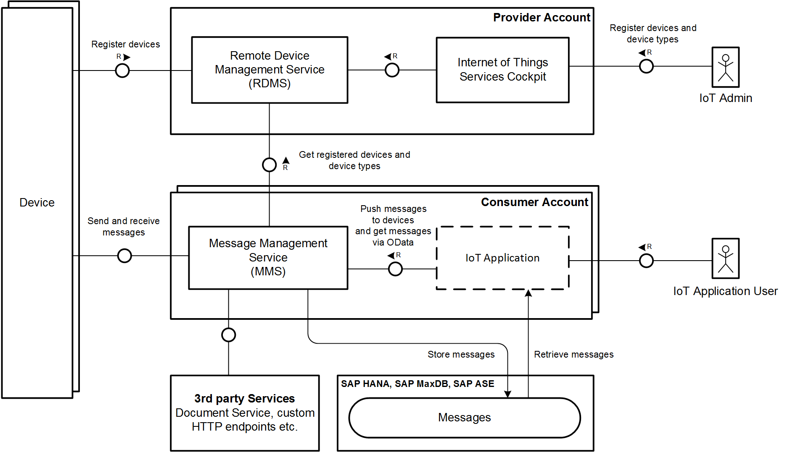

# Starter Kit for the SAP HANA Cloud Platform Internet of Things (IoT) Services

A Starter Kit for working with the [SAP HANA Cloud Platform IoT Services](http://help.hana.ondemand.com/iot)

The document and the code snippets will provide a complete end to end example of how to use the IoT Services. You will learn how to enable the Services as
well as how to send messages and how to receive push messages. Moreover, the samples for data consumption are provided. 

## Table of contents

* [HANA Cloud Platform IoT Services Overview](#hcp-iot-services-overview)
* [Getting started in the Cloud](#getting-started-in-the-cloud)
* [Sending messages from the device](#sending-messages-from-the-device)
* [Consuming the messages sent from the device](#consuming-the-messages-sent-from-the-device)
* [Pushing messages to the device](#pushing-messages-to-the-device)
* [Receiving the messages sent to the device](#receiving-the-messages-sent-to-the-device)
* [Integrated examples for IoT Devices](#integrated-examples-for-iot-devices)
* [Security Aspects](#security-aspects)
* [Revision history and related advice](#revision-history-and-related-advice)
* [What comes next](#what-comes-next)

## HCP IoT Services Overview

SAP HANA Cloud Platform IoT Services are designed to facilitate and support the implementation of Internet of Things applications. 
The services provide interfaces for registering devices and their specific data types, sending data to a data base running in 
SAP HANA Cloud Platform (HCP) in a secure and efficient manner, storing the data in HCP as well as provide easy access to the data stored.

The respective services are distributed across two main components: Remote Device Management Service (RDMS) and Message Management Service (MMS). 
Moreover, there is a web-based interface called IoT Services Cockpit which provides easy access to the various services.



MMS provides various APIs that can be used by devices to send data to the SAP HANA Cloud Platform. It processes the data and persists the data 
in the attached databases. There may be other use cases, though, which require forwarding the data to other Message Brokers or Event Stream Processors.

The Internet of Things Services Cockpit is the main interface for users to interact with the Remote Device Management Service (RDMS). 
It can be used to register new devices, to define the schema of messages (devices types and message types) they can send and/or receive, 
as well as to establish the necessary trust relationship devices need to interact with MMS. The Internet of Things Services Cockpit and RDMS 
are provided as Cloud services and can be used through subscriptions.

### IoT Business Applications

IoT Business Applications can be built using either the HANA XS, the Java or HTML5 mechanisms provided by the HCP infrastructure. 

## Getting started in the Cloud

1. [Get HANA Cloud Platform Developer Account](src/prerequisites/account)
2. [Enable Internet of Things Services](src/prerequisites/service)
3. [Create Device Information in Internet of Things Services Cockpit](src/prerequisites/cockpit)
4. [Deploy the Message Management Service (MMS)](src/prerequisites/mms)

## Sending messages from the device

* [Send messages with MMS embedded sample client using HTTP API](src/apps/embedded/sending/http)
* [Send messages with MMS embedded sample client using WebSocket API](src/apps/embedded/sending/ws)
* [Send messages with MMS embedded sample client using MQTT WebSocket API](src/apps/embedded/sending/mqttws)
* [Send messages with Python client using HTTP API](src/apps/python/sending/http)
* [Send messages with Python client using WebSocket API](src/apps/python/sending/ws)

## Consuming the messages sent from the device

* [Consume the messages with MMS embedded client](src/apps/embedded/consumption)
* [Consume the messages with Web Application based on Java and UI5 using HCP Persistence Service](src/apps/java/consumption)
* [Consume the messages with HANA XS using XSODATA and XSJS](src/apps/xs/consumption)
* [Consume the messages with Python using PyHDB](src/apps/python/consumption)
* [Consume the messages with Node.js using NodeHDB](src/apps/nodejs/consumption)
* [Consume the messages with ODATA](src/apps/odata/consumption)

## Pushing messages to the device

* [Push messages with MMS embedded sample client using HTTP and WebSocket API](src/apps/embedded/pushing)
* [Push messages with Web Application based on Java and UI5 using HTTP API](src/apps/java/consumption)

## Receiving the messages sent to the device

* [Receive the messages with MMS embedded client](src/apps/embedded/receiving)
* [Receive the messages with Python client](src/apps/python/receiving)

## Integrated examples for IoT Devices

In order to get you up and running fast we provide examples that you may use both with or without specific IoT Device hardware.

### Working with device simulators

If you want to take a quick start with a device simulation that runs on your desktop you can use two Python programs with a graphical user interface. In
order to run the programs on your desktop (Windows and OSX have been tested) you need a Python installation and the urllib3 module installed.
Please refer to the [these instructions](src/examples/python/iot-starterkit-for-desktop/README.md) for guidance on how to meet these preconditions.

With the usage of
- the device simulation that you can start with ```python iot_starterkit_desktop.py``` and that produces the User Interface shown below


- a program to send messages to the simulated device and switch its LED on or off that you start with ```python iot_starterkit_push_ui.py``` and that produces the User Interface shown below


you can already experience the functionality of an end-to-end scenario.

### Working with real IoT hardware

We provide instructions and code for usage with a Raspberry Pi and a GrovePi shield that lets you attach various input and output peripherals. In the
example we use a Slide Potentiometer for the input of values that can be changed by the user as well as an LED and an OLED graphical display for visible
output. You should be able to comfortably purchase these components and assemble them without having to solder.


Please follow these [steps to setup and use the Raspberry Pi](./src/hardware/raspberry-pi/README.md) with the shown peripherals and the 
[example application](src/examples/python/iot-starterkit-for-pi-and-grove-peripherals/iot_starterkit_pi_and_grove_peripherals.py).

In addition to the Raspberry Pi we have already used the HCP IoT Services on a [variety of other hardware](./src/hardware).

## Security aspects

Security plays a very important role for the deployment of IoT scenarios in
productive environments. The Starterkit examples concentrate of the aspect of
demonstrating basic IoT Services mechanisms. Inherently, specific usable
security mechanisms differ for different programming languages, frameworks or
hardware platforms. Thus, before making use of code snippets or integrated
examples in productive scenarios please pay additional attention on hardening
against potential attacks. We will continously provide further guidance on
potential attack vectors and how to harden your solution on the dedicated
[Security aspects](./misc/security/README.md) page.

## Revision history and related advice

The HCP IoT Services are continously developed further. Please pay attention to
the dedicated page [Revision history and related
advice](./misc/revision-history/README.md) to ensure you get specific
information about potentially necessary modifications to your older usage
examples.

## What comes next

The initial version of the IoT Starter Kit for HCP IoT Services as first published at SAPPHIRE 2015 intentionally tries to provide a simple and easy to
reproduce example. We welcome feedback on the adaptation of the HCP IoT Services and your own usage examples via the SCN page ["Try out IoT Service on SAP HANA Cloud Platform"](http://scn.sap.com/docs/DOC-63811).
