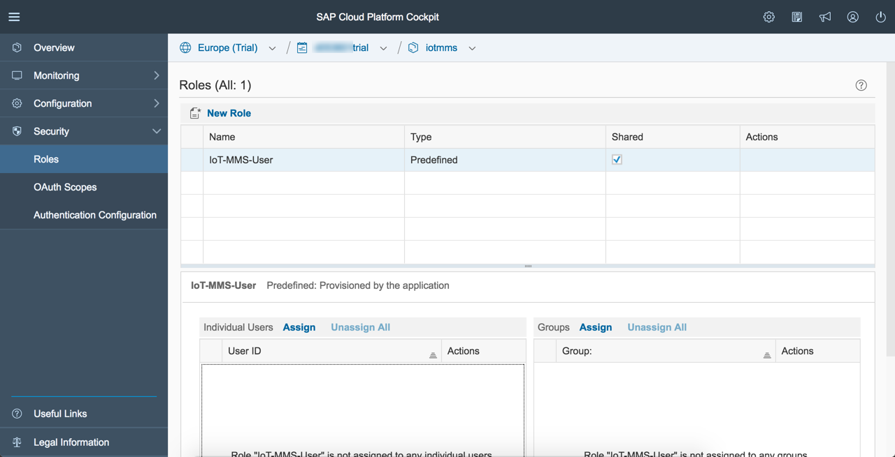
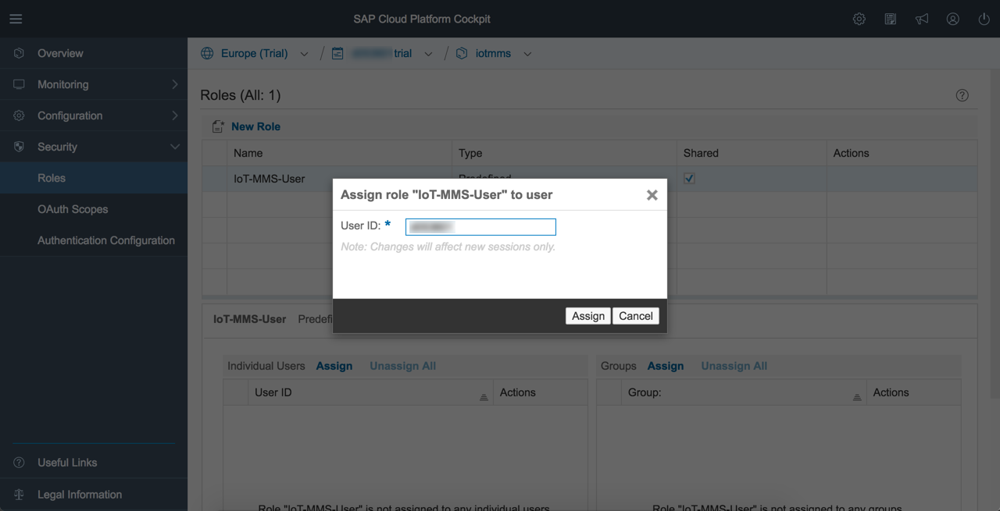

Starter Kit for the SAP HANA Cloud Platform Internet of Things (IoT) Services
=============================================================================

A Starter Kit for working with the
[SAP HANA Cloud Platform IoT Services](http://help.hana.ondemand.com/iot).

The document and the code snippets will provide a complete end to end example
of how to use the IoT Services. You will learn how to enable the Services as
well as how to send messages and how to receive push messages. Moreover, a
sample data consumption UI is provided. 

Table of contents
-------------

* [HANA Cloud Platform IoT Services Overview](#hcp-iot-services-overview)
* [Getting started in the Cloud](#getting-started-in-the-cloud)
* [Code snippets for IoT Devices](#code-snippets-for-iot-devices)
* [Integrated examples for IoT Devices](#integrated-examples-for-iot-devices)
* [Basic Consumption and User Interface alternatives](#basic-consumption-and-user-interface-alternatives)
* [What comes next](#what-comes-next)

HCP IoT Services Overview
-------

SAP HANA Cloud Platform IoT Services are designed to facilitate and support the implementation of Internet of Things applications. The services provide interfaces for registering devices and their specific data types, sending data to a data base running in SAP HANA Cloud Platform (HCP) in a secure and efficient manner, storing the data in HCP as well as provide easy access to the data stored.

The respective services are distributed across two main components: Remote Device Management Service (RDMS) and Message Management Service (MMS). Moreover, there is a web-based interface called IoT Services Cockpit which provides easy access to the various services.


MMS provides various APIs that can be used by devices to send data to the SAP HANA Cloud Platform. It processes the data and persists the data in the attached databases. There may be other use cases, though, which require forwarding the data to other Message Brokers or Event Stream Processors.

The Internet of Things Services Cockpit is the main interface for users to interact with the Remote Device Management Service (RDMS). It can be used to register new devices, to define the schema of messages (devices types and message types) they can send and/or receive, as well as to establish the necessary trust relationship devices need to interact with MMS. The Internet of Things Services Cockpit and RDMS are provided as Cloud services and can be used through subscriptions.


Getting started in the Cloud
------------

### Get HANA Cloud Platform Developer Account

You need a free SAP HANA Cloud Platform developer account (Trial instance): [`Signing Up for a Developer Account`](https://help.hana.ondemand.com/help/frameset.htm?65d74d39cb3a4bf8910cd36ec54d2b99.html)

Note: Firefox or Chrome Web Browser are recommended.


### Enable Internet of Things Services

Before you can use the services you have to enable them in your HANA Cloud Platform Cockpit. Please execute the following steps in the documentation: 

* See documentation: [`Internet of Things Services`](https://help.hana.ondemand.com/iot) > Getting Started:
 * Enabling Internet of Things Services - you need to do this step to get access to the IoT Services Cockpit.


### Deploy the Message Management Service (MMS) 

The deployment of the Message Management Service (MMS) step needs to be done from the ```Deploy Message Management Service``` tile in the IoT Services Cockpit and deploys/starts the Message Management Service that takes care of receiving data from IoT Devices and sending to these. 


Then assign the Role IoT-MMS-User for the newly deployed ```iotmms``` Java Application (otherwise you will be denied access to the ```iotmms``` Application URL with an HTTP Status 403 Error). To do so: 
* Go to the Java Applications tab in your SAP HANA Cloud Platform cockpit of your account
* Choose the ```iotmms``` application
* Choose the Roles tab of the Application details
<br />
<br />


* Do the assignment of the role to your user.
<br />
<br />


The Push Service API is protected by means of Basic Authentication. 
The usage of this mechanism needs to be enabled explicitly in the SAP HANA Cloud Platform Cockpit (otherwise you will receive a Login Page instead of a success message as answer for a Push API request).

In order to enable Basic Authentication the following steps need to be executed:
* Go to the SAP HANA Cloud Platform Cockpit and select the ```iotmms``` application from the Java Application section.
* Go to the ```Authentication Configuration``` tab.
* Change type to ```Custom```.
* Add ```User name and password``` to the selection in the ```Form``` section.
* Restart the ```iotmms``` application.

Once MMS is deployed and you have correctly done role assignment as well as the
Authentication Configuration for the Push service you can click on the
```iotmms``` Java application URL in your HCP Cockpit and get to the MMS
Cockpit as shown below. It provides access to the MMS API as well as a "Display
stored messages" tile for the access to data received from IoT Devices.


### Create Device Information in Internet of Things Services Cockpit

The following description of interaction steps with the IoT Service Cockpit
shows you how to create a Device Type and Message Types associated with it as well as a Device instance.

Remark: The specific values that you create in this process as well as the
specific OAuth Authorization Token for your Device instance need to be used to adapt
the [configuration file config.py](src/examples/python/iot-starterkit-for-desktop/template-config.py) for the example
applications.

* Open Internet of Things Service Cockpit
 * Press on the Go to Service icon of the Internet of Things Services subscription.
 * The Internet of Things Services Cockpit will open.
 
Further information: [`Internet of Things Services`](https://help.hana.ondemand.com/iot) > Getting Started > Accessing the Internet of Things Services Cockpit 


* Create Device Type
 * Press on Device Types tile in your Internet of Things Services Cockpit.
 * Press on the + button to add a new device type.
 * Enter a Name for the device type.
 * Press on Create to continue.


Further information: [`Internet of Things Services`](https://help.hana.ondemand.com/iot) > Internet of Things Services Cockpit > Configuring Device Type.


* Create Message Type
 * Press on Message Types tile in your Internet of Things Services Cockpit.
 * Press on the + button to add a new message type.
 * Enter a Name for the message type.
 * Select a Device Type from the dropdown list.
 * Select a Direction from the dropdownlist.
 * Enter a Name and select a Type for the first row of the Fields table.
 * Optional: Add additional Fields by pressing on the + button on the top right corner of the Fields table.
 * Press on Create to continue.

The examples in the Starter Kit use the following specific Message Types that you should also create in order to make the code working without any necessary modification:
* for the communication ```from Device```:
```
	sensor:string
	value:string
	timestamp:long
```


* for the communication ```to Device```:
```
	opcode:string
	operand:string
```


Further information: [`Internet of Things Services`](https://help.hana.ondemand.com/iot) > Internet of Things Services Cockpit > Configuring Message Type.


* Create Device
 * Press on Devices tile in your Internet of Things Services Cockpit.
 * Press on the + button to add a new device.
 * Enter a Name for the device.
 * Select the Device Type for the new device from the drop down menu.
 * Press on Create to continue.


 * You will see a pop-up window Device Token Generated including the Token ID generated for the new device.


 * Copy the generated Device Token since it is needed on the device as OAuth credential for secure communication with the services.

Further information: [`Internet of Things Services`](https://help.hana.ondemand.com/iot) > Internet of Things Services Cockpit > Configuring Device.

* Final result
 * You should now have created at least 1 Device Type with 2 associated Message Types and 1 Device instance.


### Authentication mechanisms
Communication with the HCP IoT Services is protected by 2 different authentication mechanisms.
* IoT Devices use OAuth authentication with a respective OAuth token for an individual device provided via the IoT Cockpit
* Applications that trigger interactions with devices via IoT Services or consume data provided by these use Basic Authentication with the respective credentials for the individual user of the HCP account

Respective credential usage is part of the provided source code examples.

Code snippets for IoT Devices
--

The IoT Starterkit provides code snippets that show the basic interactions of
an IoT device with the HCP IoT Services. These primitives are either sending or
retrieving data which are shown in 2 individual snippets for usage with an HTTP
transport and a combined one for usage via a bi-directional WebSocket
transport. All examples use encrypted communication (https, wss) which is a
prerequisite for the interaction with HCP. The snippets are provided in Python
which is also the basis for the Raspberry Pi and Device Simulation integrated
examples. Nevertheless, the respective service calls can of course also be
implemented in other programming languages.
* [insert.py](src/code-snippets/python/hcp-iot-services/https/insert.py): Using a POST request to send data from the device upstream
* [retrieve.py](src/code-snippets/python/hcp-iot-services/https/retrieve.py): Using a GET request to poll for messages pushed towards the device
* [websocket_client.py](src/code-snippets/python/hcp-iot-services/wss/websocket_client.py): Using a bi-directional WebSocket connection for both sending information upstream and receiving messages pushed to the device

These code snippets have already been integrated in [examples](./src/examples/python) that can directly be used.

Integrated examples for IoT Devices
---

In order to get you up and running fast we provide examples that you may use both with or without specific IoT Device hardware.

### Working with device simulators
If you want to take a quick start with a device simulation that runs on your
desktop you can use two Python programs with a graphical user interface. In
order to run the programs on your desktop (Windows and OSX have been tested) you
need a Python installation and the urllib3 module installed.
Please refer to the
[these instructions](src/examples/python/iot-starterkit-for-desktop/README.md) 
for guidance on how to meet these preconditions.

With the usage of
- the device simulation that you can start with ```python iot_starterkit_desktop.py``` and that produces the User Interface shown below


- a program to send messages to the simulated device and switch its LED on or off that you start with ```python iot_starterkit_push_ui.py``` and that produces the User Interface shown below


- the "Display stored messages" tile functionality in the MMS Cockpit as a simple way to show the values that are received from the simulated device 


you can already experience the functionality of an end-to-end scenario. More
sophisticated ways to consume the data and trigger interactions with a
simulated or real device are described in the section [Basic Consumption and
User Interface
alternatives](#basic-consumption-and-user-interface-alternatives).

### Working with real IoT hardware
We provide instructions and code for usage with a Raspberry Pi and a GrovePi
shield that lets you attach various input and output peripherals. In the
example we use a Slide Potentiometer for the input of values that can be
changed by the user as well as an LED and an OLED graphical display for visible
output. You should be able to comfortably purchase these components and
assemble them without having to solder.


Please follow these [steps to setup and use the Raspberry Pi](./src/hardware/raspberry-pi/README.md) with the shown peripherals and the 
[example application](src/examples/python/iot-starterkit-for-pi-and-grove-peripherals/iot_starterkit_pi_and_grove_peripherals.py).

Basic Consumption and User Interface alternatives
--

In addition to interacting with the HCP IoT Services via their network service
API there are various alternatives to consume the data that attached IoT
devices produce. A basic graphical interface for doing so exists with the MMS
Cockpit.


As shown in the following screenshot it lists the interfaces exposed by MMS and lets you interact via built-in sample clients.


Additionally the data received from attached IoT devices can be viewed when opening the tile "Display stored messages".


IoT Business Applications (shown once more with their interactions in the
diagram below) can be built using either the HANA XS, the Java or HTML5
mechanisms of the HCP infrastructure. 


There is example code for a Java Application that produces the HTML5 based User
Interface shown below.


The necessary steps to adapt this application for your specific Device and Message Types as well as your Device instance, to compile, deploy and start it are [described together with the example source code](./src/apps/java/consumption).

What comes next
-------
The initial version of the IoT Starter Kit for HCP IoT Services as first
published at SAPPHIRE 2015 intentionally tries to provide a simple and easy to
reproduce example. We welcome feedback on the adaptation of the HCP IoT
Services and your own usage examples via the SCN page ["Try out IoT Service on SAP HANA Cloud Platform"](http://scn.sap.com/docs/DOC-63811).
