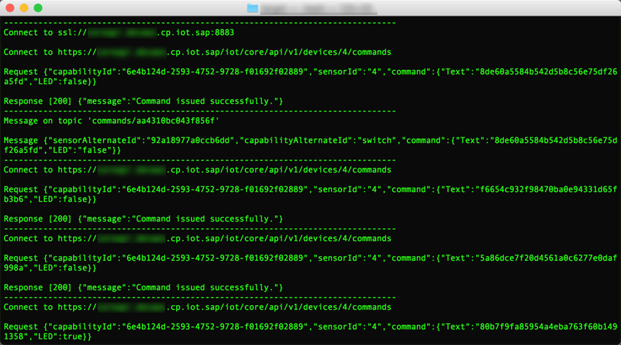

# SAP Internet of Things for the Cloud Foundry Environment
A sample Java application which is capable to send Switch commands to the Device and listen to them on behalf of the device (direct delivery over MQTT or polling via RESTful interface).

## Import project
This sample application is provided as Maven project and could be imported to IDE with the help of respective plug-in or Maven command line interface.

## Run application from the IDE
- Run [Main class](src/main/java/sample/Main.java) as Java application.

## Build with Maven
It is possible to build an executable JAR with Maven. Simply run `mvn clean install` from the command line.

>Note: After the very first import from GitHub, ensure to build the top-level [java-samples](../) reactor project.

### Run compiled version
- Find the compiled version under project's `target` directory
- Execute from the command line `java -jar send-command.jar`

>Note: In order to save efforts when typing sample properties every time you launch an application, you may place the `sample.properties` file at the same level to your executable JAR. A template for such a file could be found under [resources](src/main/resources/sample.properties)




## Execution Steps
The following steps are being performed during execution:

1. Get online gateway (either REST or MQTT) based on the user input.
    ```
    Authorization: Basic <base64-encoded credentials>
    GET https://%iot.host%:443/%instance.id%/iot/core/api/v1/tenant/%tenant.id%/gateways?filter=protocolId eq '%gateway.protocol.id%' and status eq 'online' and type eq 'cloud'
    ```
2. Get online device by its identifier.
    ```
    Authorization: Basic <base64-encoded credentials>
    GET https://%iot.host%:443/%instance.id%/iot/core/api/v1/tenant/%tenant.id%/devices/%device.id%
    ```
	1. Create a new device if it does not exist or no online device with the specified identifier was found in the MQTT gateway.
	    ```
	    Authorization: Basic <base64-encoded credentials>
	    POST https://%iot.host%:443/%instance.id%/iot/core/api/v1/tenant/%tenant.id%/devices  
		{  
		   "gatewayId":"%gateway.id%",
		   "name":"SampleDevice"
		}
	    ```
3. Check if custom "Switch" capability exists.
    ```
    Authorization: Basic <base64-encoded credentials>
    GET https://%iot.host%:443/%instance.id%/iot/core/api/v1/tenant/%tenant.id%/capabilities
    ```
	1. Create "Switch" capability if not found.
	    ```
	    Authorization: Basic <base64-encoded credentials>
	    POST https://%iot.host%:443/%instance.id%/iot/core/api/v1/tenant/%tenant.id%/capabilities  
		{  
		   "alternateId":"switch",
		   "name":"Switch",
		   "properties":[  
		      {  
		         "name":"Text",
		         "dataType":"string"
		      },
		      {  
		         "name":"LED",
		         "dataType":"boolean"
		      }
		   ]
		}
	    ```
4. Check if custom "Ambient" capability exists.
    ```
    Authorization: Basic <base64-encoded credentials>
    GET https://%iot.host%:443/%instance.id%/iot/core/api/v1/tenant/%tenant.id%/capabilities
    ```
	1. Create "Ambient" capability if not found.
	    ```
	    Authorization: Basic <base64-encoded credentials>
	    POST https://%iot.host%:443/%instance.id%/iot/core/api/v1/tenant/%tenant.id%/capabilities  
		{  
		   "alternateId":"ambient",
		   "name":"Ambient",
		   "properties":[  
		      {  
		         "name":"Humidity",
		         "dataType":"integer",
		         "unitOfMeasure":"%"
		      },
		      {  
		         "name":"Temperature",
		         "dataType":"float",
		         "unitOfMeasure":"°C"
		      },
		      {  
		         "name":"Light",
		         "dataType":"integer",
		         "unitOfMeasure":"Lux"
		      }
		   ]
		}
	    ```
5. Check if custom "ControlUnit" sensor type exists.
    ```
    Authorization: Basic <base64-encoded credentials>
    GET https://%iot.host%:443/%instance.id%/iot/core/api/v1/tenant/%tenant.id%/sensorTypes
    ```
	1. Create "ControlUnit" sensor type if not found.
	    ```
	    Authorization: Basic <base64-encoded credentials>
	    POST https://%iot.host%:443/%instance.id%/iot/core/api/v1/tenant/%tenant.id%/sensorTypes  
		{  
		   "name":"ControlUnit",
		   "capabilities":[  
		      {  
		         "id":"%ambient.capability.id%",
		         "type":"measure"
		      },
		      {  
		         "id":"%switch.capability.id%",
		         "type":"command"
		      }
		   ]
		}
	    ```
6. Get device sensor which is assigned to the device.
	1. Create a new sensor and assign it to the device if no sensor is assigned to the device or a sensor has no reference to the "ControlUnit" sensor type.
	    ```
	    Authorization: Basic <base64-encoded credentials>
	    POST https://%iot.host%:443/%instance.id%/iot/core/api/v1/tenant/%tenant.id%/sensors  
		{  
		   "deviceId":"%device.id%",
		   "sensorTypeId":"%sensor.type.id%",
		   "name":"SampleSensor"
		}
	    ```
	    >Note: A new sensor will be mapped to the custom "ControlUnit" Sensor Type.
7. Get device PEM-certificate.
    ```
    Authorization: Basic <base64-encoded credentials>
    GET https://%iot.host%:443/%instance.id%/iot/core/api/v1/tenant/%tenant.id%/devices/%device.id%/authentications/clientCertificate/pem
    ```
8. Create Java SSL context based on the PEM certificate.
9. As a device, listen for incoming commands.
    ```
    Authorization: <device-certificate>
    REST: GET https://%iot.host%:443/iot/gateway/rest/commands/%device.alternate.id%
    MQTT: SUBSCRIBE ssl://%iot.host%:8883 on topic 'commands/%device.alternate.id%'  
    ```
    >Note: The listening is going to be terminated automatically after 20 seconds.

10. Send Switch commands to the device.
    ```
    Authorization: Basic <base64-encoded credentials>
    POST https://%iot.host%:443/%instance.id%/iot/core/api/v1/tenant/%tenant.id%/devices/%device.id%/commands
	{  
	   "capabilityId":"%switch.capability.id%",
	   "sensorId":"%sensor.id%",
	   "command":{  
	      "Text":"%random.text%",
	      "LED":"true | false"
	   }
	}
    ```
    >Note: The sending rate is one command per second. Duration is 5 seconds.