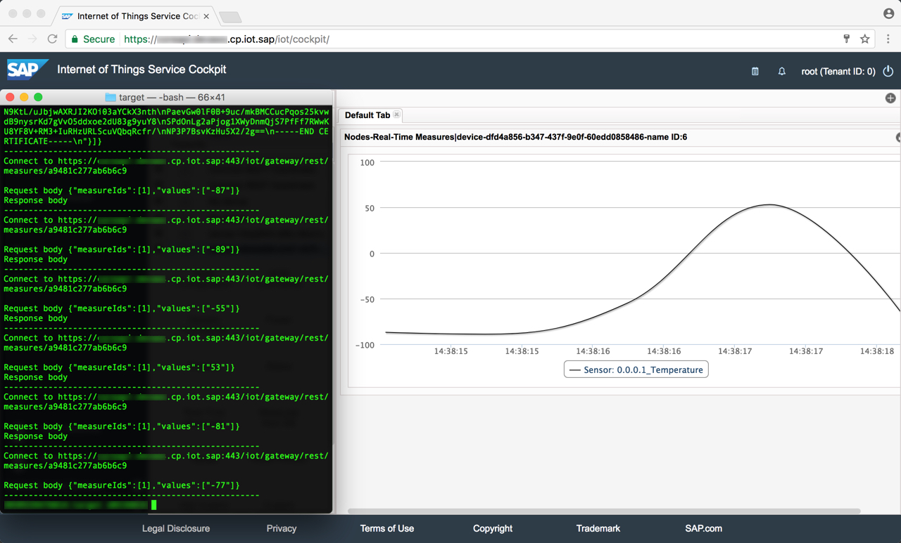

# SAP Internet of Things for the Cloud Foundry Environment

A sample Java application which is capable to send Temperature measures to the Gateway Cloud either via HTTP or MQTT protocol using the PEM-Certificate based authentication. The following steps are being performed during execution:

1. Get online gateway (either REST or MQTT based on the user-specified type)
```
Authorization: Basic <base64-encoded credentials>
GET https://%iot.host%:443/iot/core/api/v1/gateways
```
2. Get online device having the user-specified identifier
```
Authorization: Basic <base64-encoded credentials>
GET https://%iot.host%:443/iot/core/api/v1/devices/%device.id%
```
2.1. Create a device if does not exists or no online device with the specified identifier was found
```
Authorization: Basic <base64-encoded credentials>
POST https://%iot.host%:443/iot/core/api/v1/devices  
{
	"gatewayId" : "%gateway.id%",
	"name" : "%device.name%"
}
```
3. Get device sensor having the user-specified identifier assigned to the device
3.1. Create a sensor if none is assigned to the device
```
Authorization: Basic <base64-encoded credentials>
POST https://%iot.host%:443/iot/core/api/v1/sensors  
{
	"deviceId" : "%device.id%",
	"sensorTypeId" : "%sensorType.id%",
	"name" : "%sensor.name%"
}
```
4. Get device PEM-certificate 
```
Authorization: Basic <base64-encoded credentials>
GET https://%iot.host%:443/iot/core/api/v1/devices/%device.id%/authentication/pem
```
5. Create Java SSL context out PEM certificate
6. Send random Temperature measures on behalf of the device (frequency = 1 seconds; duration = 5 seconds)
```
For REST: POST https://%iot.host%:443/iot/gateway/rest/measures/%device.physicalAddress%
For MQTT: PUBLISH ssl://%iot.host%:8883 on topic 'measures/%device.physicalAddress%'  

{
	"measureIds" : [ 1 ],
	"values" : [ "%temperature.random.value%" ]
	"logNodeAddr" : [ "%sensor.physicalAddress%" ]
}
```
 
>Note: A standard sample message with with the default measure ID "1" and random temperature value from "-100" to "100" is used in this example

## Import project
An application is provided as Maven project and could be imported to IDE with the respective plug-in or Maven command line interface.

## Run application from IDE
- Run [Main class](src/main/java/sample/Main.java) as Java application.

## Build with Maven
It is possible to build an executable JAR with Maven. Simply run `mvn clean install` from the command line.

>Note: After the very first import from GitHub, ensure to build the top-level java-samples reactor project.

## Run compiled version
- Find the compiled version under project's `target` directory
- Execute from the command line `java -jar send-gateway-cloud-default-measure.jar`

>Note: In order to save efforts when typing configuration properties every time you start an application, you may place the `config.properties` file at the same level to your executable JAR. A template for such a file could be found in [resources](src/main/resources/sample.properties)

