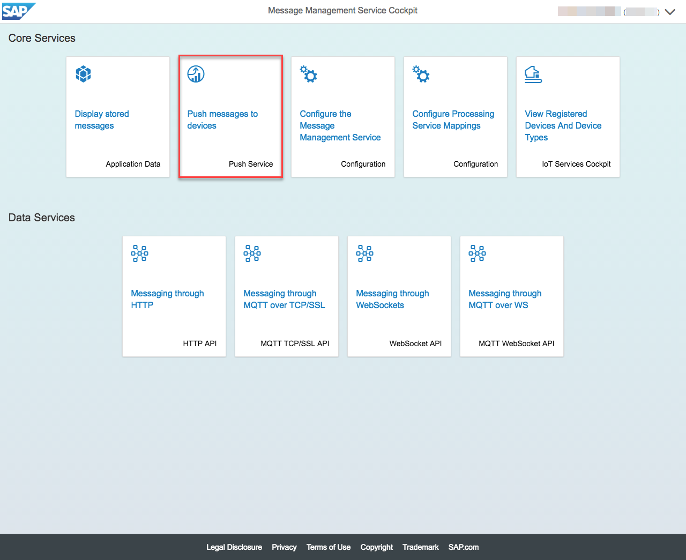
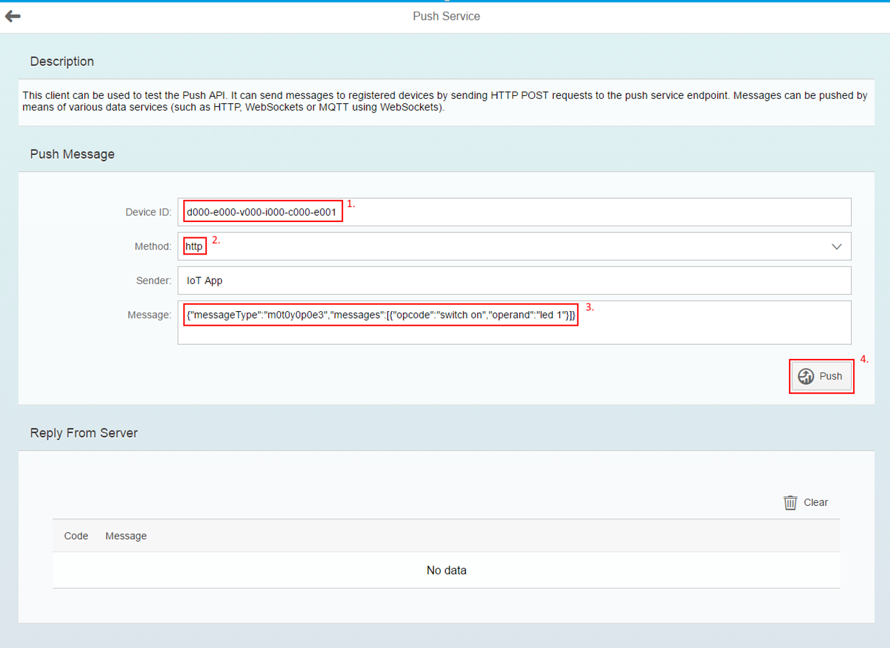

# Pushing messages to the device

## Push messages with MMS built-in sample client using HTTP and WebSocket API

* Click on "Push Service" tile

1. Adapt the Device ID if required
2. Adapt the transport protocol (either HTTP or WebSocket)
3. Adapt the Message if required
3. Click on Push button

