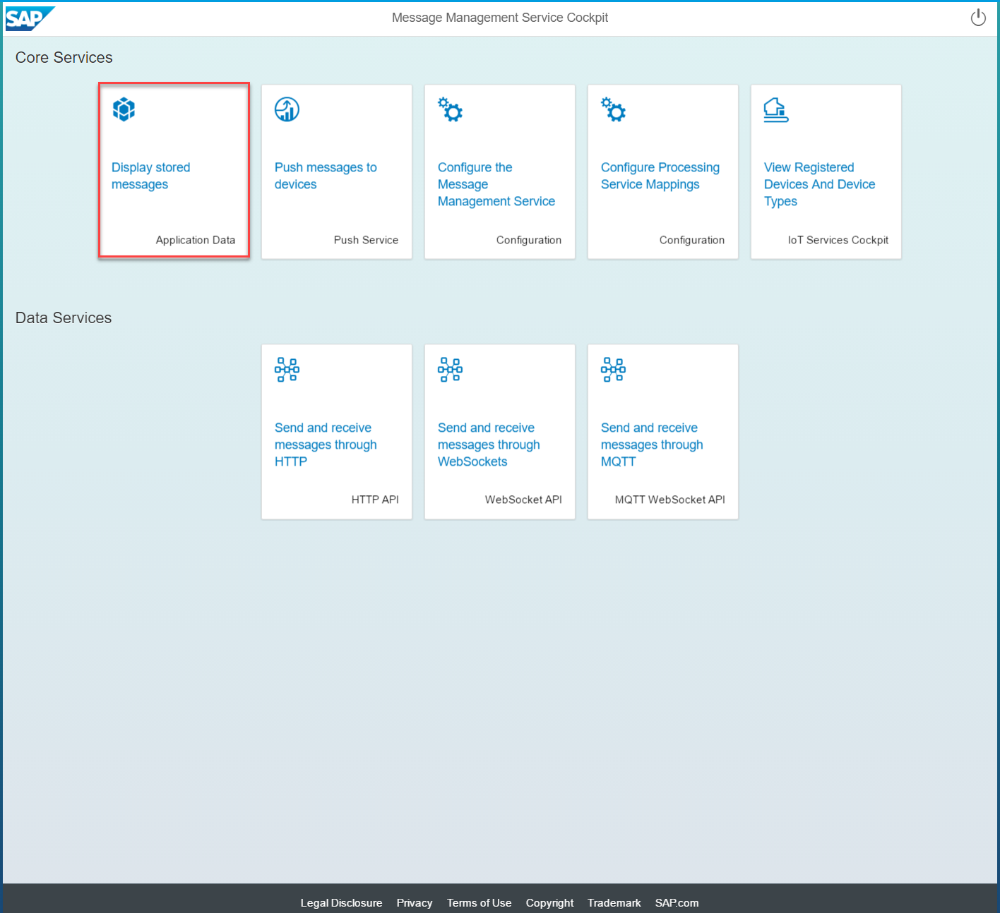
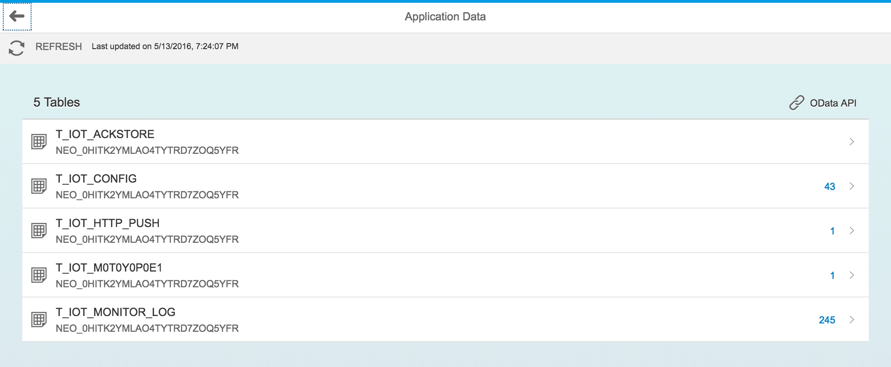
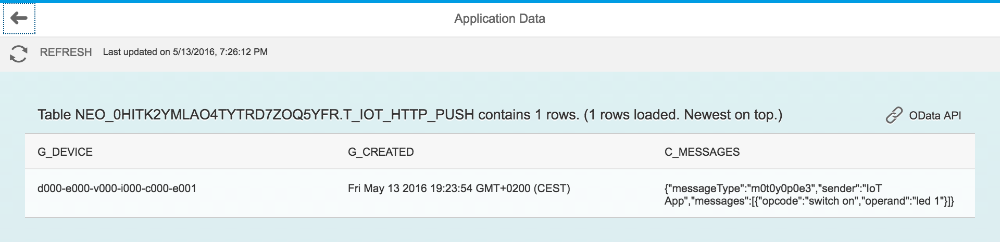

# Receiving the messages sent to the device

## Receive the messages with MMS built-in client

* Click on "Application Data" tile

* Select the "T_IOT_HTTP_PUSH" table to see the messages sent to the device

