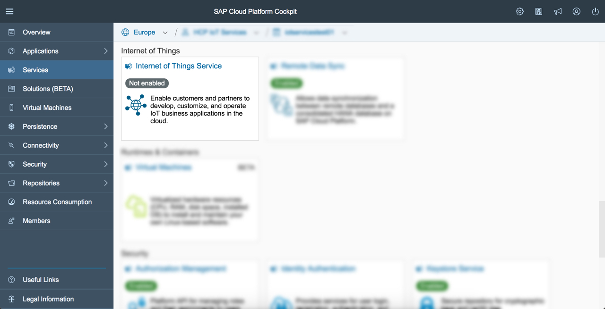

# Getting started in the Cloud

## Enable Internet of Things

>Previous Step [Get SAP Cloud Platform Developer Account](../account)

Before you can use Internet of Things you have to enable it in your SAP Cloud Platform Cockpit. Please execute the following steps in the documentation: 

For more details, please see the documentation: [Internet of Things](https://help.hana.ondemand.com/iot) > Getting Started > Enabling Internet of Things

You will need to do these steps to get access to the Internet of Things Cockpit:
 
* In your SAP Cloud Platform Cockpit navigate to "Services" section and click on "Internet of Things" tile.

* Press "Enable" button.

You are now ready for the next step and may already click on "Go to Service" link for that.

>Next Step [Create Device Information in Internet of Things Cockpit](../cockpit)