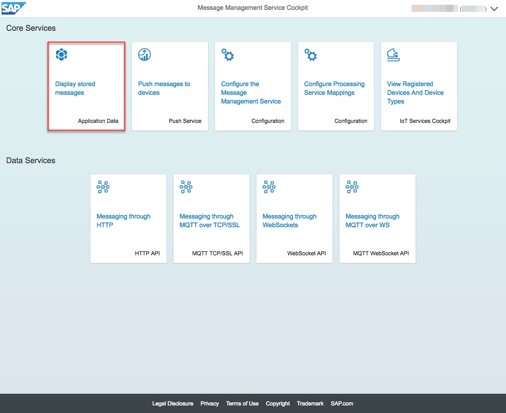

# Consuming the messages sent from the device

## Consume the messages with MMS built-in client

In addition to interacting with the HCP IoT Services via their network service API there are various alternatives to consume the data that attached IoT
devices produce. A basic graphical interface for doing so exists with the MMS Cockpit.

* Click on "Application Data" tile

* Select the respective IoT table referencing your Message Type

