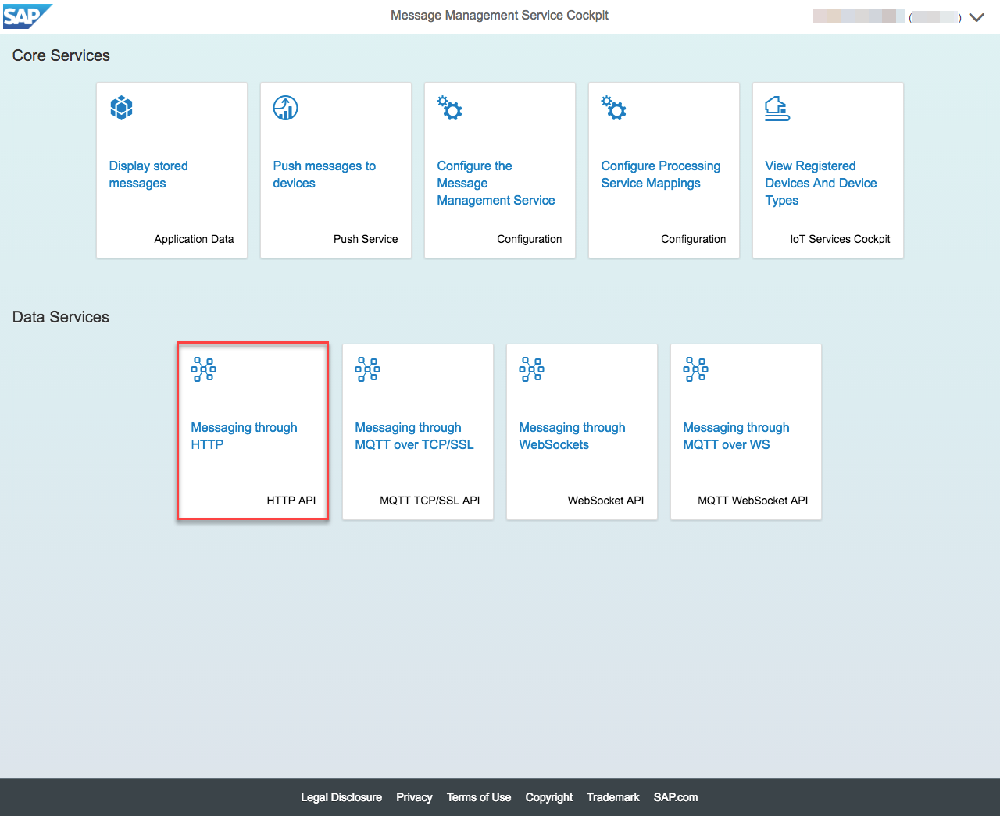
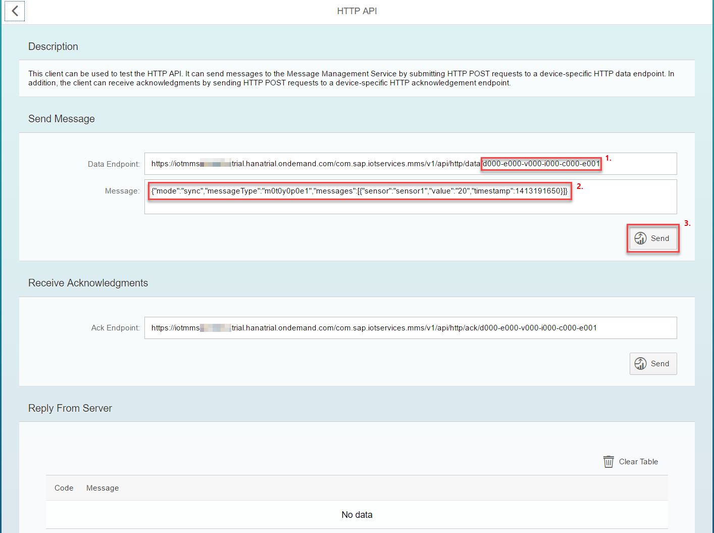
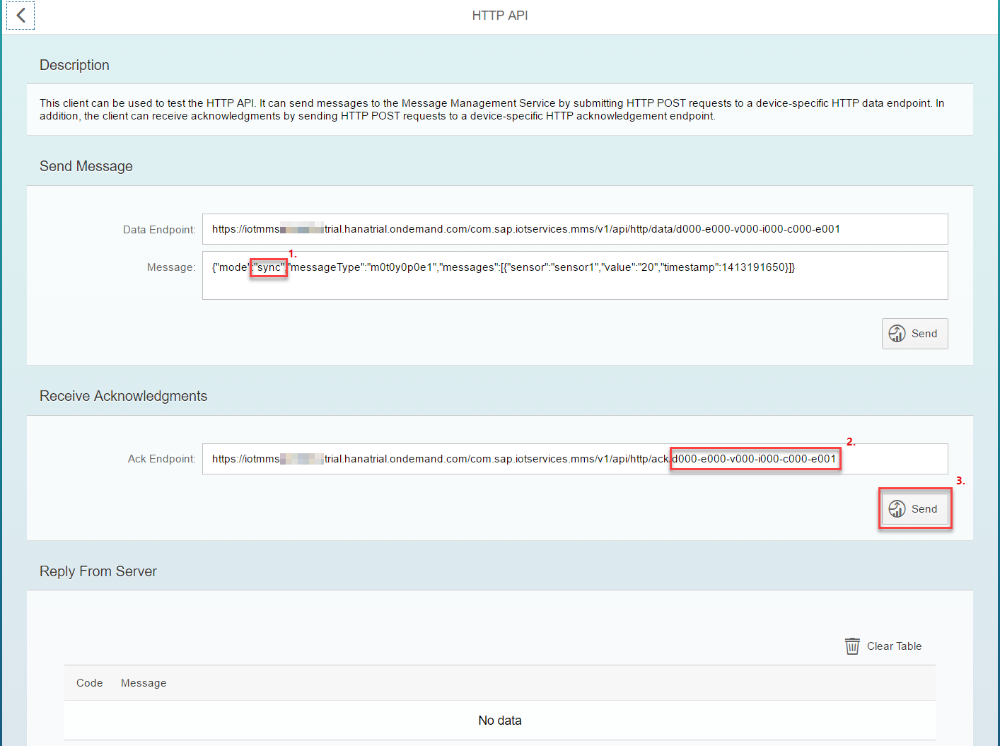

# Sending messages from the device

## Send messages with MMS built-in sample client using HTTP API

* Click on "HTTP API" tile

1. Adapt the Device ID if required
2. Adapt the Message if required
3. Click on Send button

1. In case you are not using "sync" mode for sending messages.
2. Adapt the Device ID if required
3. Click on Send to get the acknowledgements.

