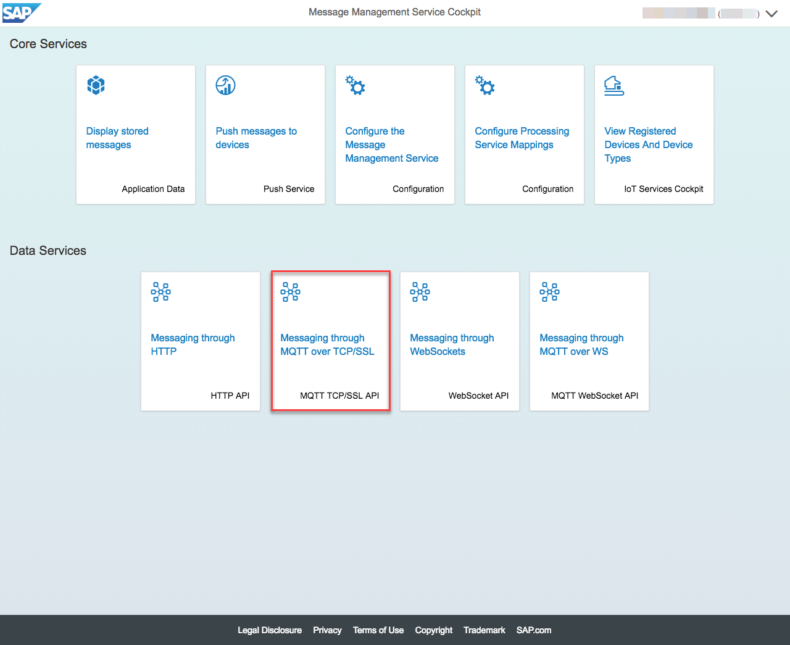

# Sending messages from the device

## Send messages with MMS built-in sample client using MQTT over WebSocket API

* Click on "Configuration" tile

1. Enter the MQTT Broker Endpoint
2. Enable the MQTT Connection
3. Enter the MQTT Password
4. Enter the MQTT User Name
5. Click on Save Changes button

* Click on "MQTT TCP/SSL API" tile

1. Adapt the Device ID if required
2. Click on Connect button

1. Adapt the Message if required
2. Unsubscribe from subscription topics if required
  * Log topic to receive success and error messages
  * Ack topic to receive acknowledgments
  * Push topic to receive push messages
2. Click on Send button

