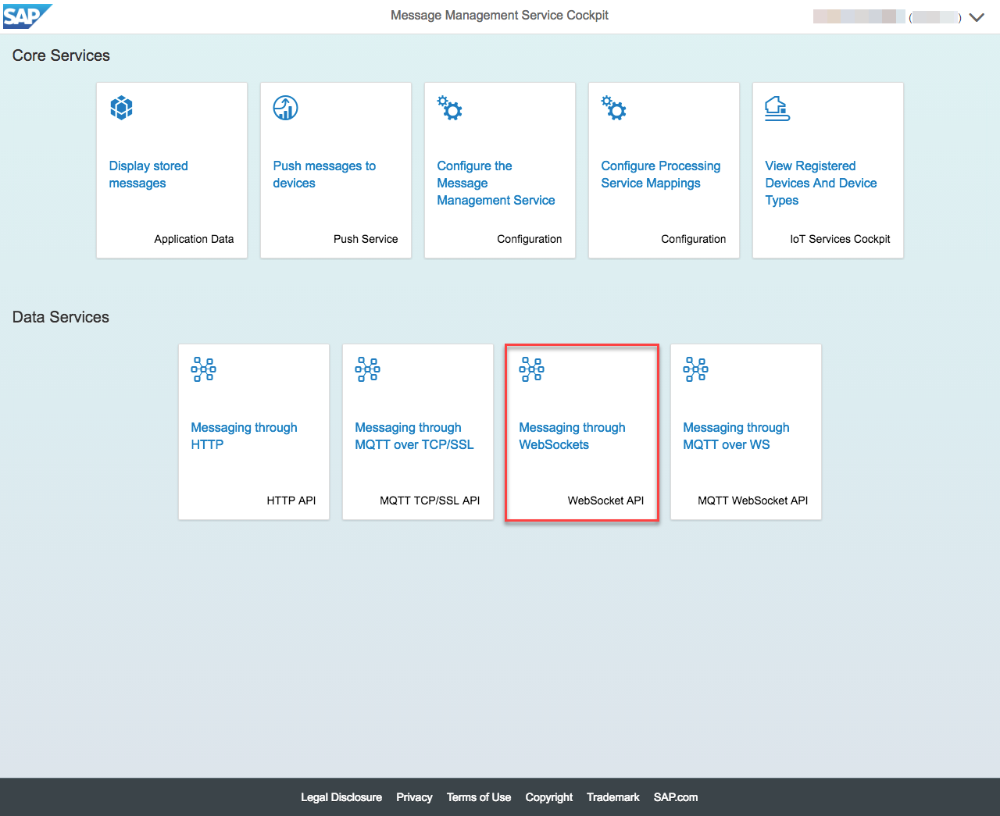
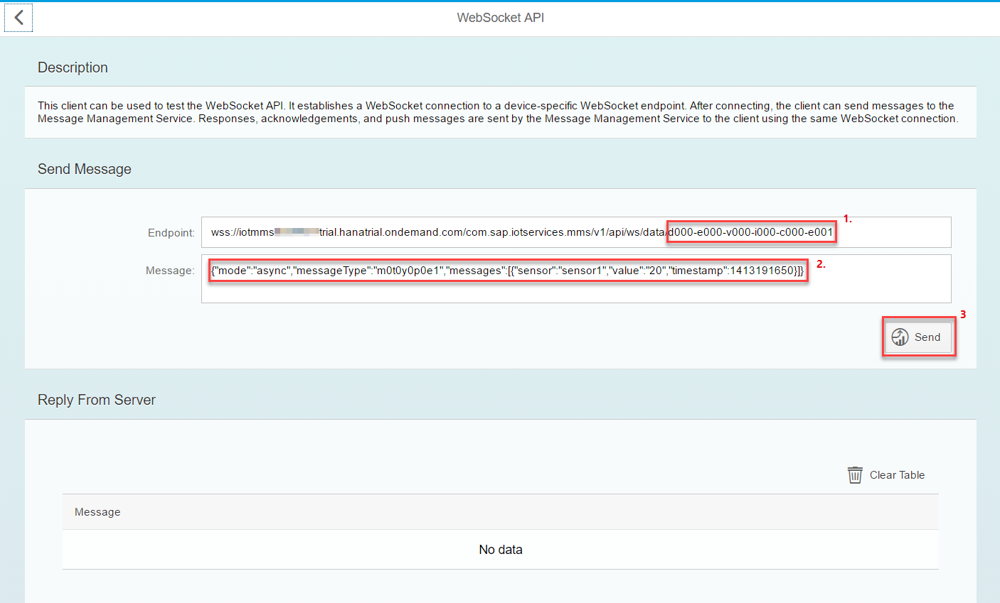

# Sending messages from the device

## Send messages with MMS built-in sample client using WebSocket API

* Click on "HTTP API" tile

1. Adapt the Device ID if required
2. Adapt the Message if required
3. Click on Post button

