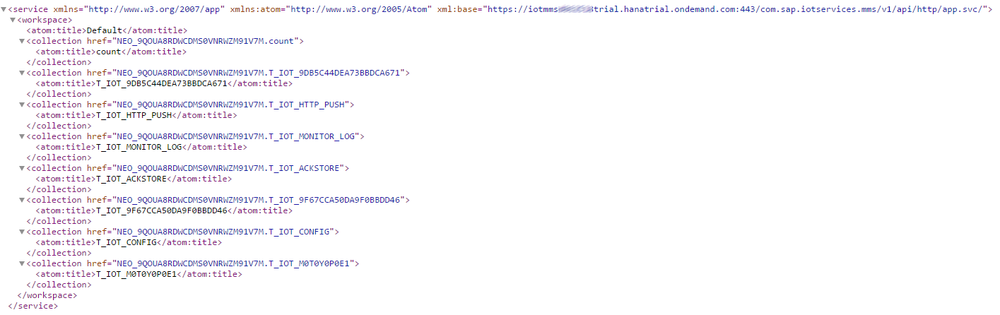

# Consume the messages with MMS ODATA API
This directory explains how the stored data can be consumed with ODATA. The Message Management Service provides an ODATA V2 interface which can be used to retrieve data and metadata of stored tables.

## Access ODATA

The service root URI matches the following pattern:

*  GET: **/com.sap.iotservices.mms/v1/api/http/app.svc**

The following image shows the result of a GET request to the service root URI. The request lists all registered metadata tables and data tables.

Metadata tables are identified by their human readable name like the following (for better clarity the schema name is skipped):

*  **T_IOT_ACKSTORE** (Contains acknowledgments)
*  **T_IOT_HTTP_PUSH** (Contains push messages)
*  **T_IOT_CONFIG** (Contains the Message Management Service configuration)
*  **T_IOT_MONITOR_LOG** (Contains monitor logging)
*  **T_IOT_PROCESSING_SERVICE_CONFIG** (Contains the processing service mapping configuration)

Data tables are identified by their message type id (for better clarity the schema name is skipped)

*  **T_IOT_9DB5C44DEA73BBDCA671** (A custom table)
*  **T_IOT_9F67CCA50DA9F0BBDD46** (A custom table)
*  **T_IOT_M0T0Y0P0E1** (Table for default message type)

## Supported queries

This section explains all ODATA queries that are supported by the Message Management Service. For better clarity the root URI is assigned to **rootUrl**.

*  **rootUrl** = /com.sap.iotservices.mms/v1/api/http/app.svc

### Get application specific content

Get the metadata of all tables

*  GET: **&lt;rootUrl&gt;/$metadata**

Get the row count of all tables tablewise 

* GET: **&lt;rootUrl&gt;/count**

### Get table specific content

Get the messages stored in a specific table

* GET: **&lt;rootUrl&gt;/&lt;tableName&gt;**

#### Count

Get the row count of a specifc table

* GET: **&lt;rootUrl&gt;/&lt;tableName&gt;/$count**

#### Format

Get the messages stored in a specific table as JSON

* GET: **&lt;rootUrl&gt;/&lt;tableName&gt;?$format=json**

#### Top

Get a limited number of messages stored in a specific table

* GET: **&lt;rootUrl&gt;/&lt;tableName&gt;?$top=&lt;amount&gt;**

#### Skip

Get the messages with an offset in a specific table

* GET: **&lt;rootUrl&gt;/&lt;tableName&gt;?$skip=&lt;amount&gt;**

#### Orderby

Get the messages sorted by message field

* GET: **&lt;rootUrl&gt;/&lt;tableName&gt;?$orderby=&lt;columnName&gt;**

#### Filter

Get the messages filtered by message field values

* GET: **&lt;rootUrl&gt;/&lt;tableName&gt;?$filter=&lt;columnName&gt; &lt;operator&gt; '&lt;values&gt;'**

The supported binary operators are:
* eq (Equal)
* ne (Not equal)
* lt (Less than)
* le (Less than or equal)
* gt (Greater than)
* ge (Greater than or equal)

Of course the binary operators can be combined with the logical operators:
* and (Logical and)
* or (Logical or)

## Unsupported queries

All queries that are not listed in this document are not supported by the Message Management Service. These are functions are:
* $select
* $expand
* $inlinecount

## Examples

All of these queries listed above can be combined as the ODATA specification describes.

Get top 5 messages stored in a specific table as JSON

* GET: **&lt;rootUrl&gt;/&lt;tableName&gt;?$top=5&$format=json**

Get top 5 messages skipped by 10 messages stored in a specific table as JSON 

* GET: **&lt;rootUrl&gt;/&lt;tableName&gt;?$top=5&skip=10&$format=json**

Get top 5 messages ordered by C_VALUE ascending stored in a specific table as JSON 

* GET: **&lt;rootUrl&gt;/&lt;tableName&gt;?$top=5&$orderby=C_VALUE asc&$format=json**

Get all messaged where C_VALUE equals 40 in a specific table

* GET: **&lt;rootUrl&gt;/&lt;tableName&gt;?$filter=C_VALUE eq '40'**

Get top 5 messages where C_VALUE equals 40 in a specific table as JSON

* GET: **&lt;rootUrl&gt;/&lt;tableName&gt;?$filter=C_VALUE eq '40'&$top=5&$format=json**