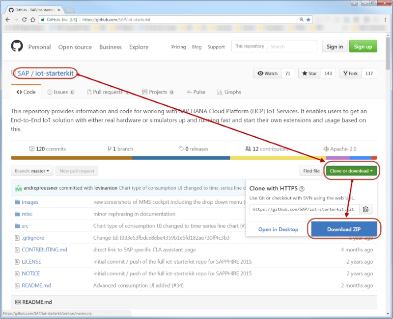
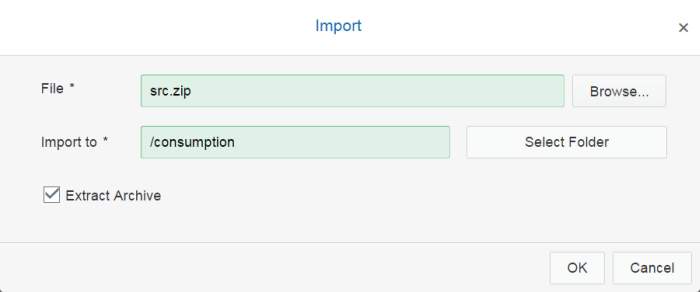
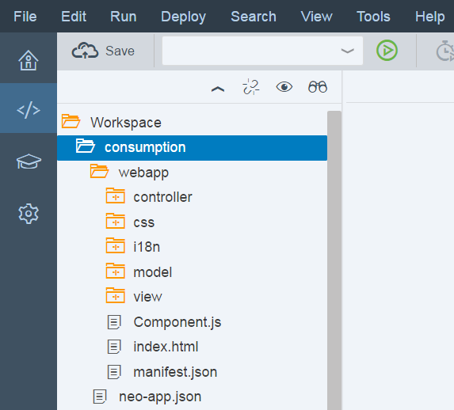
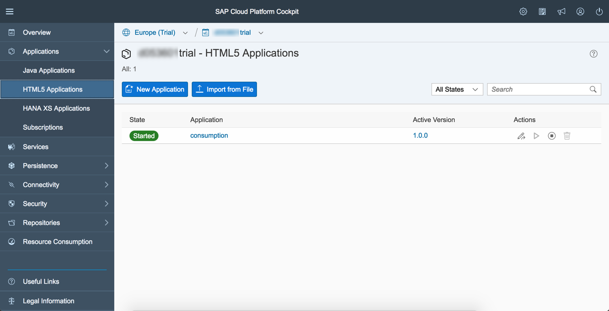

This directory contains an HCP HTML5 application demonstrating the consumption of MMS data via OData, and displaying them in a time-series line chart.
The application loads available devices from RDMS via REST API and allows the selection of the values to be displayed on the Y-axis of the chart.
It also demonstrates the display of live data via an automatic refresh.


This application can be used as an out-of-the-box consumption UI in an end-to-end scenario, where you do not want to use the fixed message type required by the [simple consumption UI](../consumption).

### Prerequisites
#### Setup IoT Services
The sample application needs an instance of the IoT Services running on the same HCP account, where the application shall run.
Please refer to the IoT Services setup guide [`Internet of Things Services`](https://help.hana.ondemand.com/iot)` > Getting Started`.

#### Download the IoT Starterkit
Go to the [main folder of the GitHub repository](https://github.com/SAP/iot-starterkit) and download the IoT Starterkit.



Extract the downloaded Zip file to a local folder and navigate to the sample application folder ```<path to IoT Starterkit>\iot-starterkit-master\src\apps\ui5\consumption-advanced```.
This folder contains two subfolders:
- ```destinations``` contains the destinations for accessing IoT RDMS and IoT MMS, and
- ```src``` contains the source code of the sample application.

#### Import Destinations
Open the HCP Cockpit in a browser and go to ``` Connectivity > Destinations ```.


Choose ``` Import Destination ```, navigate to the ``` destinations ``` folder of the sample application and import the file ```iotmms```.
Enter your HCP ``` User ``` and ``` Password ```. In the ``` Url ``` you need to exchange:
- ```%account_id%``` - the name of your HCP account, which can be found on the ```Overview``` page of the HCP Cockpit under ```Account Information > Account Name```
- ```%landscape_name%``` - the name of the HCP landscape, which can be found as part of the HCP Cockpit URL between ```https://account.``` and ```.ondemand.com```,
e.g., on HCP Trial the URL is ```https://account.hanatrial.ondemand.com/cockpit``` and the landscape name is ``` hanatrial ```.


It is also recommended to click on the ```Check Connection``` button after you save your imported destination to verify your connectivity.
*Note:* This check validates only the URL, not the user and password.


Import the RDMS destination ```iotrdms``` in the same way. Enter your HCP ``` User ``` and ``` Password ```, and adapt the service ``` Url ```.


#### Import the Application in SAP Web IDE
To run the sample application, you first need to import it in the SAP Web IDE.
Go *into* the ``` src ``` folder of the sample application and zip the ```webapp``` folder and the ```neo-app.json``` file (*Important:* do not include the ```src``` folder in the zip file).


Open the HCP Cockpit, go to ```Services``` and click on the tile ```SAP Web IDE```. If you have never used the Web IDE before, you may need to enable it first.
Click ```Open SAP Web IDE```.

In the Web IDE click ```File > Import > File From System  ``` and choose the zipped file. Enter an application folder name of your choice in ```Import to```.



The application is now available in your workspace.



### Run the Application

To run the sample application, right click on the application folder in the Web IDE and choose ```Run > Run as > Web Application ```.

*Note*: The application expects IoT RDMS and IoT MMS to run. Make sure to follow the instructions of the IoT Services setup guide ([`Internet of Things Services`](https://help.hana.ondemand.com/iot)` > Getting Started`).
You should also create at least one message type, device type and device. 

### Deploy the Application to HCP

If you want to run the sample application directly from the HCP Cockpit, you need to deploy it into your HCP account.

Right click your project folder in WebIDE and choose ```Deploy > Deploy to SAP HANA Cloud Platform ```. Follow the intructions of the wizard. Ignore the step for registering the application in the Fiori Lanchpad.
After the deployment you find the application in the HCP Cockpit under ```Applications > HTML5 Applications```.



Click on the link in the ```Application``` column to open the application details. In the section ```Active Version``` you find the ```Application URL``` to open the application.

### Usage

The consumption application is devided into two parts: The configuration panel at the top, and the chart view.

When starting the application, the chart is invisible. You must select a device, a message type, and at least one measure (which corresponds to a message type field) for the chart to be drawn. You can select multiple measures. Note that the ```timestamp``` field is automatically chosen for the X-axis (time axis). 
The ```Refresh Model``` button next to the device selection reloads the available devices, device types and message types from RDMS.


When the ```Chart Auto Refresh``` option is switched on, the chart data are reloaded each second.

```Show Last``` allows to set the number of values shown in the chart, e.g., select ```50``` to show the last 50 values in MMS for the chosen measures.

### Troubleshooting
If the sample application does not show devices or the chart does not show data, there are a couple of things to check.

1. Check the destinations. URL, User and Password must must be correct. Note that ```Check Connection``` validates only the URL.
2. Check that the IoT Services are running, and the roles are set correctly for RDMS and MMS.
See the [FAQ](https://help.hana.ondemand.com/iot/frameset.htm?a012a3788b6e498a8971dd27c97ce6bf.html) for typical problems and solutions.
3. Check that at least one device exists. If not, create one.
4. Check that data are available for the device. You can use the MMS Cockpit, which can be accessed in the HCP Cockpit under ```Applications > Java Applications > iotmms```.
Click the tile ```Display Stored Messages``` and open the table with name ```T_IOT_```+```<Message Type ID>```.
If such a table does not exist or it is empty, sending data to MMS did not work.
Try one of these methods: [Sending messages from the device](../../../../README.md#sending-messages-from-the-device).