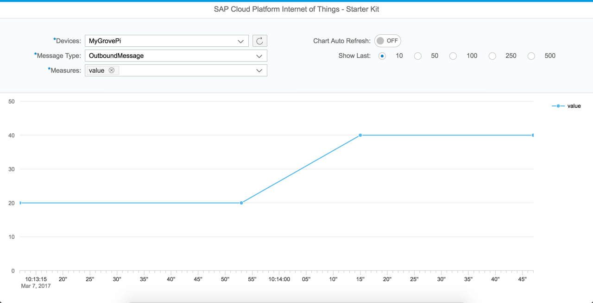
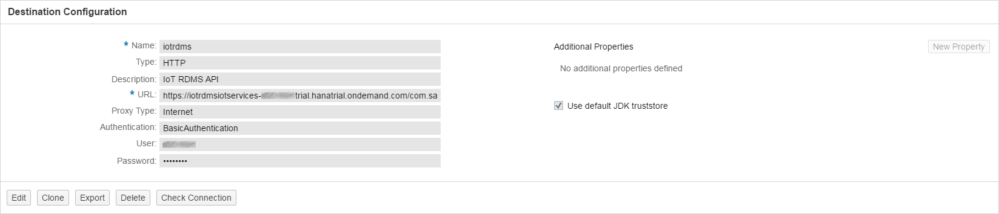

This directory contains an HCP HTML5 application demonstrating the consumption of MMS data via OData, and displaying them in a time-series line chart.
The application loads available devices from RDMS via REST API and allows the selection of the values to be displayed on the Y-axis of the chart.
It also demonstrates the display of live data via an automatic refresh.



This application can be used as an out-of-the-box consumption UI in an end-to-end scenario, where you do not want to use the fixed message type required by the [simple consumption UI example](../consumption).

### Prerequisites
Download the source of our example application to your system. At first we need to setup destinations to access the MMS and the RDMS from our UI5 application. The destinations can be found in the ``` destination ```  directory of the sample application. Go to the HCP Cockpit and in ``` Connectivity ``` tab click on the ``` Destinations ``` like it is shown in the following image.


Choose ``` Import Destination ``` in order to import the existing MMS destination. Please take care to adopt your HCP ``` user ```, ``` password ``` as well as the service ``` url ```. Acceptable values for the ``` %landscape_name% ``` placeholder in the URL are ``` hana ``` and ``` hanatrial ```.


It is also recommended to click on a "Check Connection" button after you save your imported Destination to verify your connectivity.


After importing the MMS destination you need to import the RDMS destination the same way. Please take care to adopt your ``` user ```, the ``` url ``` and to insert your HCP ``` password ```.



### Edit
In order to edit or execute our example application go *into* the ``` src ``` directory. This folder contains the webapp folder and one configuration file. Zip the webapp folder and the configuration file and upload the sample application to the HCP.

Open the HCP WebIDE ( ``` HCP Cockpit > Services > SAP Web IDE > Open SAP Web IDE ``` ) and import the zip file into your workspace. Click ``` File > Import > File From System  ``` choose the zipped file and name a destination folder. 


You are now ready to edit the sample application. In order to execute the sample application ``` Right Click > Run > Run as > Web Application ```

Note that this sample application just shows data for message types that contain a ``` timestamp ``` field. See the source code for details.

### Deploy

The deployment of the application into your HCP account is straight forward. 
``` Right Click your project folder in WebIDE (Example: src) > Deploy > Deploy to SAP HANA Cloud Platform ```. Follow the intructions of the wizard.

### Usage

The consumption application is devided into two parts: The configuration panel at the top, and the chart view.

When starting the application, the chart is invisible. You must select a device, a message type, and at least one measure (which corresponds to a message type field) for the chart to be drawn. You can select multiple measures. Note that the ```timestamp``` field is automatically chosen for the X-axis (time axis). 
The ```Refresh Model``` button next to the device selection reloads the available devices, device types and message types from RDMS.


When the ```Chart Auto Refresh``` option is switched on, the chart data are reloaded each second.

```Show Last``` allows to set the number of values shown in the chart, e.g., select ```50``` to show the last 50 values in MMS for the chosen measures.
