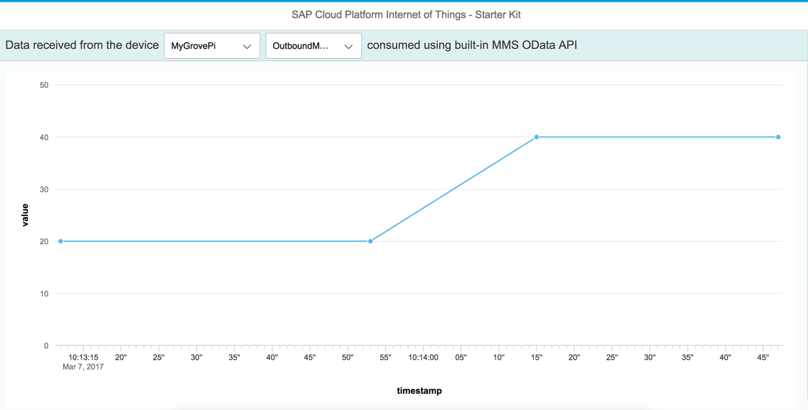

This directory has the sources for a UI5 application that uses the HCP IoT Services to interact with an IoT Device. It renders the received data that is stored in the database (where the MMS part of the IoT Services writes to) in an xy plot using the MMS built-in OData API. Per default the chart show the last 100 values of the chosen device.



This application is deliberately kept simple to provide an easy starting point for understanding data consumption via the MMS OData API.
If you are looking for an advanced application with more configuration possibilities and live data updates, please refer to the [advanced consumption UI](../consumption-advanced).

### Prerequisites
#### Setup IoT Services
The sample application needs an instance of the IoT Services running on the same HCP account, where the application shall run.
Please refer to the IoT Services setup guide [`Internet of Things Services`](https://help.hana.ondemand.com/iot)` > Getting Started`.

#### Download the IoT Starterkit
Go to the [main folder of the GitHub repository](https://github.com/SAP/iot-starterkit) and download the IoT Starterkit.


Extract the downloaded Zip file to a local folder and navigate to the sample application folder ```<Path to IoT Starterkit>\iot-starterkit-master\src\apps\ui5\consumption```.
This folder contains two subfolders:
- ```destinations``` contains the destinations for accessing IoT RDMS and IoT MMS, and
- ```src``` contains the source code of the sample application.

#### Import Destinations
Open the HCP Cockpit in a browser and go to ``` Connectivity > Destinations ```.


Choose ``` Import Destination ```, navigate to the ``` destinations ``` folder of the sample application and import the file ```iotmms```.
Enter your HCP ``` User ``` and ``` Password ```. In the ``` Url ``` you need to exchange:
- ```%account_id%``` - the name of your HCP account, which can be found on the ```Overview``` page of the HCP Cockpit under ```Account Information > Account Name```
- ```%landscape_name%``` - the name of the HCP landscape, which can be found as part of the HCP Cockpit URL between ```https://account.``` and ```.ondemand.com```,
e.g., on HCP Trial the URL is ```https://account.hanatrial.ondemand.com/cockpit``` and the landscape name is ``` hanatrial ```.


It is also recommended to click on the ```Check Connection``` button after you save your imported destination to verify your connectivity.
*Note:* This check validates only the URL, not the user and password.


Import the RDMS destination ```iotrdms``` in the same way. Enter your HCP ``` User ``` and ``` Password ```, and adapt the service ``` Url ```.


#### Import the Application in SAP Web IDE
To run the sample application, you first need to import it in the SAP Web IDE.
Go *into* the ``` src ``` folder of the sample application and zip the ```webapp``` folder and the ```neo-app.json``` file (***Important:*** Do not include the ```src``` folder in the zip file).


Open the HCP Cockpit, go to ```Services``` and click on the tile ```SAP Web IDE```. If you have never used the Web IDE before, you may need to enable it first.
Click ```Open SAP Web IDE```.

In the Web IDE click ```File > Import > File From System  ``` and choose the zipped file. Enter an application folder name of your choice in ```Import to```.


The application is now available in your workspace.


### Run the Application

To run the sample application, right click on the application folder in the Web IDE and choose ```Run > Run as > Web Application ```.

*Note*: The application expects IoT RDMS and IoT MMS to run. Make sure to follow the instructions of the IoT Services setup guide ([`Internet of Things Services`](https://help.hana.ondemand.com/iot)` > Getting Started`).
You should also create at least one message type, device type and device. 
Note that this sample application just shows data for message types that contain a ``` timestamp ``` and a ``` value ``` field. See the source code for details.

### Deploy the Application to HCP

If you want to run the sample application directly from the HCP Cockpit, you need to deploy it into your HCP account.

Right click your project folder in WebIDE and choose ```Deploy > Deploy to SAP HANA Cloud Platform ```. Follow the intructions of the wizard. Ignore the step for registering the application in the Fiori Lanchpad.
After the deployment you find the application in the HCP Cockpit under ```Applications > HTML5 Applications```.


Click on the link in the ```Application``` column to open the application details. In the section ```Active Version``` you find the ```Application URL``` to open the application.

### Modify the Application

In case you would need to display another measurement value on Y-Axis different from the ``` value ``` field of your message type, please modify the UI5 data source binding right in the source code i.e.
[main.view.js](src/webapp/view/main.view.js) line #120.
A value should match the next pattern ``` {odata>C_<MESSAGE_TYPE_FIELD_NAME>} ```.

Per default, the chart shows the last 100 values. If you want to change this number, or want to load all available values, open
[main.controller.js](src/webapp/controller/main.controller.js) and go to line #132:
```javascript
	this.oDataset.bindAggregation("data", {
		path: "odata>/T_IOT_" + sMessageTypeId,
		// number of values to be displayed in the chart
--->	length: 100,
		// filter for the selected device
		filters: [
			new sap.ui.model.Filter("G_DEVICE", sap.ui.model.FilterOperator.EQ, sDeviceId)
		],
		//sort by timestamp to get the last, and not the first x values
		sorters: [
			new sap.ui.model.Sorter("C_TIMESTAMP", true)
		]
	});
```
Change the value of the ```length``` property to the number of values you want to load. Remove the whole code line to load all values.

### Troubleshooting
If the sample application does not show devices or the chart does not show data, there are a couple of things to check.

1. Check the destinations. URL, User and Password must must be correct. Note that ```Check Connection``` validates only the URL.
2. Check that the IoT Services are running, and the roles are set correctly for RDMS and MMS.
See the [FAQ](https://help.hana.ondemand.com/iot/frameset.htm?a012a3788b6e498a8971dd27c97ce6bf.html) for typical problems and solutions.
3. Check that at least one device with a message type of the expected format exists.
See [Create Device Information in Internet of Things Services Cockpit](../../../prerequisites/cockpit).
4. Check that data are available for the device. You can use the MMS Cockpit, which can be accessed in the HCP Cockpit under ```Applications > Java Applications > iotmms```.
Click the tile ```Display Stored Messages``` and open the table with name ```T_IOT_```+```<Message Type ID>```.
If such a table does not exist or it is empty, sending data to MMS did not work. Try one of these methods: [Sending messages from the device](../../../../README.md#sending-messages).