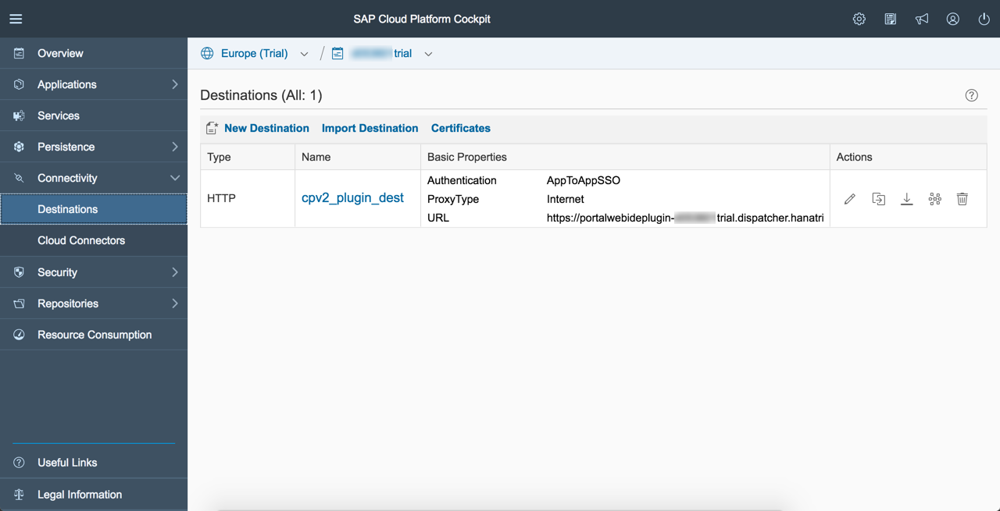

This directory has the sources for a UI5 application that uses the HCP IoT Services to interact with an IoT Device. It renders the received data that is stored in the database (where the MMS part of the IoT Services writes to) in an xy plot. 


### Prerequisites
Download the source of our example application to your system. At first we need to setup destinations to access the MMS and the RDMS from our UI5 application. The destinations can be found in the ``` destination ```  directory of the sample application. Go to the HCP Cockpit and click on the ``` Destinations ``` tab like it is shown in the following image.



Choose ``` Import Destination ``` in order to import the existing destination. Please take care to adopt your ``` user ```, the ``` url ``` and to insert your HCP ``` password ```.


You have to import both destinations in order to get the example working.

### Edit
In order to edit or execute our example application go to the ``` src ``` directory. This folder contains the webapp folder and some configuration files. To upload the sample application to the HCP all source files have to be zipped. 

Open the HCP WebIDE and import the zip file into your workspace. ``` Click > File > Import > File From System  ``` choose the zipped file and name a destination folder. 


You are now ready to edit the sample application. In order to execute the sample application ``` Right Click > index.html > Run > Run index.html ```

Note that this sample application just shows data for message types that contain a ``` timestamp ``` and a ``` value ``` field. See the source code for details.

### Deploy

The deployment of the application into your HCP account is straight forward. 
``` Right Click your project folder in WebIDE (Example: src) > Deploy > Deploy to SAP HANA Cloud Platform ```. Follow the intructions of the wizard. 