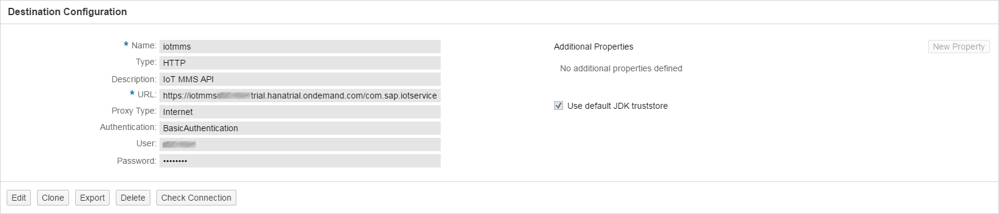

This directory has the sources for a UI5 application that uses the HCP IoT Services to interact with an IoT Device. It renders the received data that is stored in the database (where the MMS part of the IoT Services writes to) in an xy plot using the MMS built-in OData API. Per default the chart show the last 100 values of the chosen device.


This application is deliberately kept simple to provide an easy starting point for understanding data consumption via the MMS OData API. If you are looking for an advanced application with more configuration possibilities and live data updates, please refer to the [advanced consumption UI](../consumption-advanced).

### Prerequisites
Download the source of our example application to your system. At first we need to setup destinations to access the MMS and the RDMS from our UI5 application. The destinations can be found in the ``` destination ```  directory of the sample application. Go to the HCP Cockpit and in ``` Configuration ``` tab click on the ``` Destinations ``` like it is shown in the following image.


Choose ``` Import Destination ``` in order to import the existing MMS destination. Please take care to adopt your HCP ``` user ```, ``` password ``` as well as the service ``` url ```. Acceptable values for the ``` %landscape_name% ``` placeholder in the URL are ``` hana ``` and ``` hanatrial ```.



It is also recommended to click on a "Check Connection" button after you save your imported Destination to verify your connectivity.


After importing the MMS destination you need to import the RDMS destination the same way. Please take care to adopt your ``` user ```, the ``` url ``` and to insert your HCP ``` password ```.


### Edit
In order to edit or execute our example application go *into* the ``` src ``` directory. This folder contains the webapp folder and one configuration file. Zip the webapp folder and the configuration file and upload the sample application to the HCP.

Open the HCP WebIDE and import the zip file into your workspace. ``` Click > File > Import > File From System  ``` choose the zipped file and name a destination folder. 


You are now ready to edit the sample application. In order to execute the sample application ``` Right Click > Run > Run as > Web Application ```

Note that this sample application just shows data for message types that contain a ``` timestamp ``` and a ``` value ``` field. See the source code for details.

### Deploy

The deployment of the application into your HCP account is straight forward. 
``` Right Click your project folder in WebIDE (Example: src) > Deploy > Deploy to SAP HANA Cloud Platform ```. Follow the intructions of the wizard. 

### Modify

In case you would need to display another measurement value on Y-Axis different from the ``` value ``` field of your message type, please modify the UI5 data source binding right in the source code i.e.
[main.view.js](src/webapp/view/main.view.js) line #120.
A value should match the next pattern ``` {odata>C_<MESSAGE_TYPE_FIELD_NAME>} ```.

Per default, the chart shows the last 100 values. If you want to change this number, or want to load all available values, open
[main.controller.js](src/webapp/controller/main.controller.js) and go to line #132:
```javascript
	this.oDataset.bindAggregation("data", {
		path: "odata>/T_IOT_" + sMessageTypeId,
		// number of values to be displayed in the chart
--->	length: 100,
		// filter for the selected device
		filters: [
			new sap.ui.model.Filter("G_DEVICE", sap.ui.model.FilterOperator.EQ, sDeviceId)
		],
		//sort by timestamp to get the last, and not the first x values
		sorters: [
			new sap.ui.model.Sorter("C_TIMESTAMP", true)
		]
	});
```
Change the value of the ```length``` property to the number of values you want to load. Remove the whole code line to load all values.