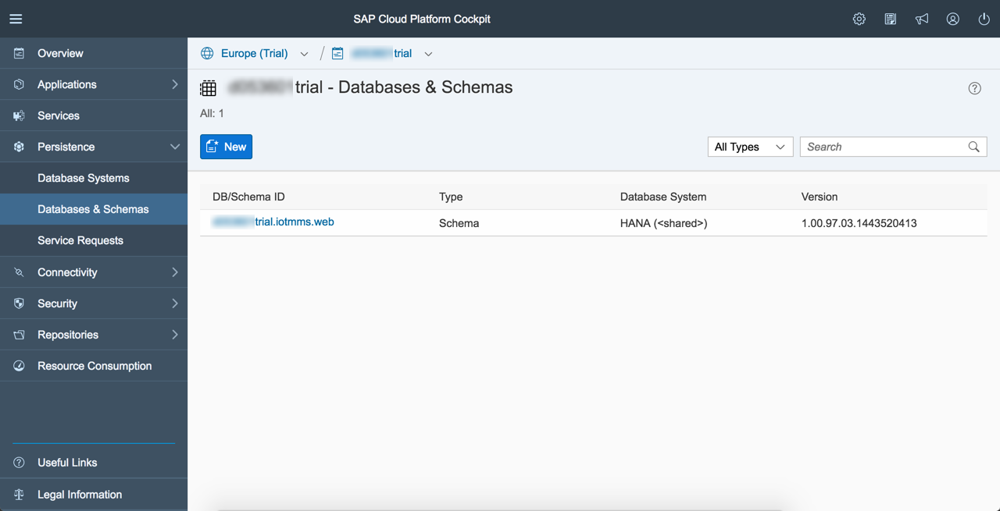
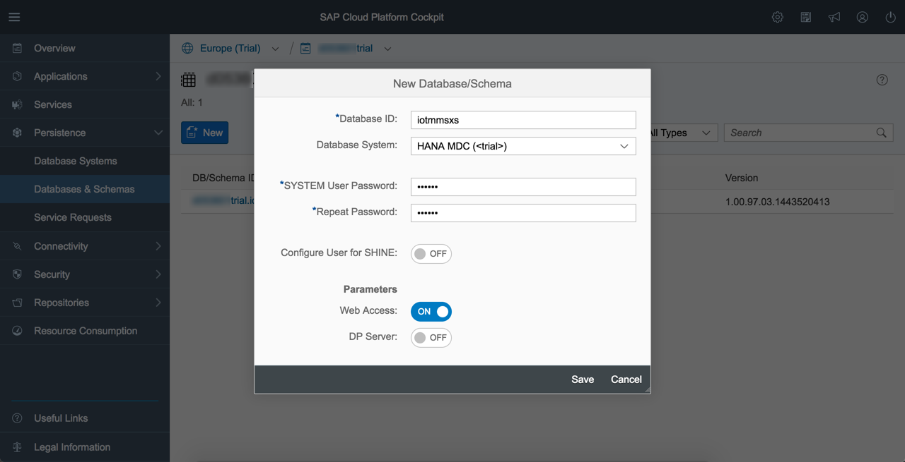
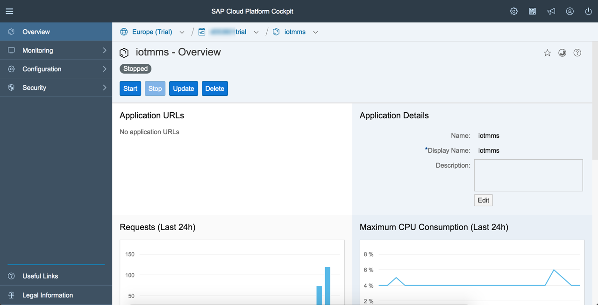
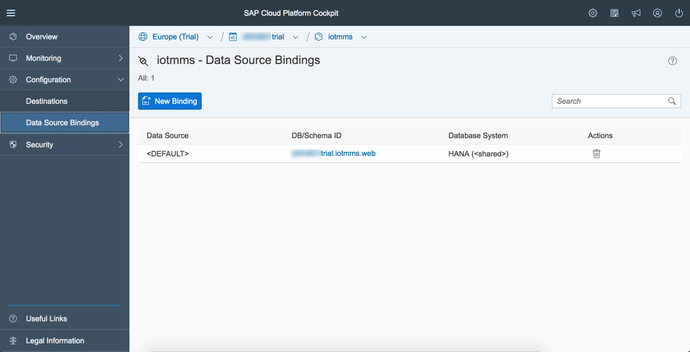
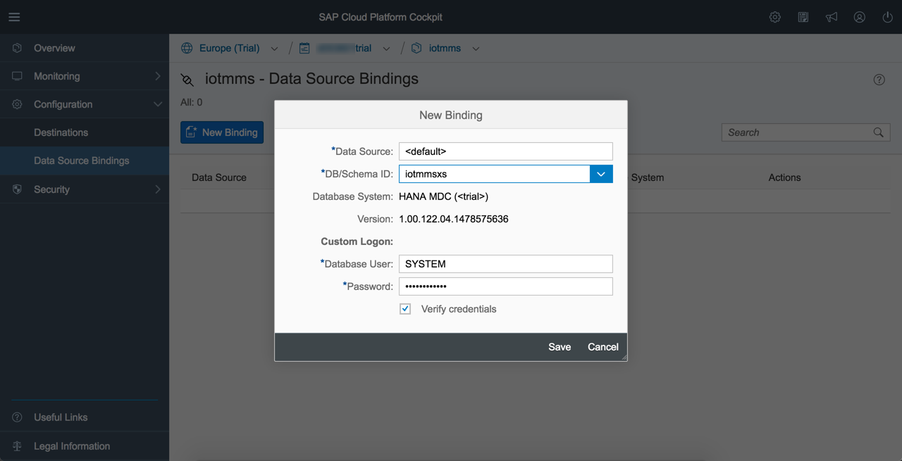

This directory has the sources for a XSODATA and XSJS services that expose the IOT data out the data storage.

### Message Storage

Messages can be send to the HCP IoT Services using the Message Management Service (MMS) component deployed in the consumer account. By default MMS stores incoming messages into a relational database. 
The respective message tables are automatically created by MMS based on the message type definitions. More details can be found in the IoT Services documentation.
By default, MMS uses the automatically created database (schema) for storing data and the default data source binding for accessing this schema. 
The name of the underlying database schema is displayed in the "Databases & Schemas" section of the HCP Cockpit. The default data source bindings for this schema are also displayed on this page. 
In the example below, MMS is bound to a shared HANA instance.

The default schema binding can be changed to point to a dedicated HANA instance or any other database available in HCP. HANA MDC will be used in this example.

### Creating and configuring HANA MDC instance

Click on New, select HANA MDC Database, give it a name i.e. "iotmmsxs" and specify a password for your Database user. Please, note that your Database user is "SYSTEM" be default.

Wait until the Database is created and started

Navigate to Overview, re-check the Database state and then click on SAP HANA Cockpit at the bottom

Once prompted, specify your Database user "SYSTEM" and password you have given above when creating MDC

Click OK to be assigned with the necessary Administration roles

Continue after successful message popup is shown

This will navigate you to SAP HANA Cockpit

Select "Manage Roles and Users" tile, choose your user "SYSTEM" and assign it with the roles required for the Web-based Tools, like stated in the [documentation](https://help.hana.ondemand.com/help/frameset.htm?d7c4ca5dac4f4dbbb47901eebe9ea0d1.html) 

### Changing the database binding of MMS

Navigate to Java Applications, select "iotmms" and stop it

Select "Data Source Bindings" and delete the default binding for HANA system

Create a new default binding to the HANA MDC "iotmmsxs", specify your Database user "SYSTEM" and password as Custom Logon, save your changes

Start your "iotmms" Java application

 

Launch "iotmms", navigate to HTTP Sample Client and send some data on behalf of the embedded device (or use a real one). With that a T_IOT* table is created in the Database under your user schema (it has a "SYSTEM" name same to your user).

 

In order to check Database content, navigate to HANA MDC Overview and click on SAP HANA Web-based Development Workbench at the bottom

 

Select "Catalog" tile

 

Find your Database user schema "SYSTEM", expand its Tables and show the content of the T_IOT table

  

### HANA XS Development

Now we are ready for XS development. Only the browser based tools will be used for that.

Select "Editor" tile

 

Create a new package under Content

 

Give it a name i.e. "iotmmsxs" and press Create

 

[Drag and drop or create the missing files](iotmmsxs) in the following order:

- .xsapp
- .xsprivileges
- .xsaccess
- iotservice.xsodata

Do not forget to activate them.

The content of your package should look as follows

 

If you try to run your XSODATA service immediately by clicking on green run button on top, this will result in 403 Forbidden error, because Application privileges are missing for your user.

 

Select "Security" tile

 

Choose your user "SYSTEM" and navigate to "Application Privileges" tab

 

Select "iotmmsxs::Basic" privilege form the list and confirm your changes

 

Now when launching XSODATA service, it will return you the Service Root

 

Adding /$metadata at the end of the URL will give you the Metadata

And Entity Set is then accessible when adding a concrete one at the end of the URL

 
You may also consume the data with XSJS after activating and launching the [iotservices.xsjs](iotmmsxs) script

