# MQTT Ingest
Imagine you already have a device that publishes its data to an external MQTT broker where its message format as well as MQTT topic do not conform to what [MQTT over TCP Data Service](https://help.hana.ondemand.com/iot/frameset.htm?a9764708d68b43e59c823218d1aa6346.html) expects.  

A proposed solution to overcome that problematic would be an IoT (Java) application hosted in the SAP Cloud Platform which is capable to subscribe for incoming MQTT messages from the device, transform the payload to Message Management Service (MMS) compatible format and publish the message to MMS using its [MQTT over WebSocket Data Service](https://help.hana.ondemand.com/iot/frameset.htm?56d02092904346c1a605713021d2f875.html)  

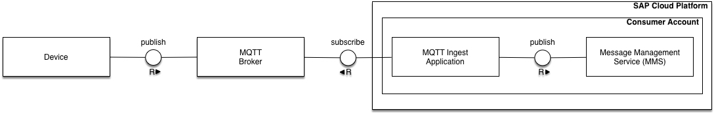  

>MQTT Ingest application could be hosted in the same consumer account where MMS is deployed but not limited to.

## Prerequisites
* You have basic knowledge about Git and Maven
* You know how to deploy Java applications on SAP Cloud Platform
* You have SAP Cloud Platform Internet of Things service enabled and configured for your account
* You have basic knowledge about MQTT protocol

## Import project
An application is provided as a Maven project and could be imported to IDE workspace with the respective plug-in or IDE embedded import functionality.

## Compile project
Build a WAR archive with Maven. Run `mvn clean install` either from the command line or from IDE. You will find your WAR archive then under project's `/target` directory.

#Example setup
Let's have a concrete example described in details. An Arduino compatible LoRaWAN node called [Badgerboard](http://badgerboard.io) will play the role of our device sending its sensor data over [iC880a concentrator board](https://github.com/ttn-zh/ic880a-gateway/wiki) - The Things Network (TTN) LoRaWAN-enabled Gateway to [TTN](https://www.thethingsnetwork.org) acting as an external [MQTT Broker](https://www.thethingsnetwork.org/docs/applications/mqtt) 

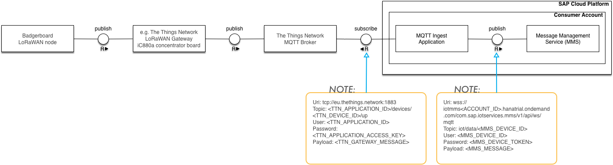  

##Input format
A device is publishing its sensor data for topic `ttnappid/devices/ttndeviceid/up` with the following payload
```
{ 
   "app_id":"ttnappid",
   "dev_id":"ttndeviceid",
   "hardware_serial":"00A1B1506523DE20",
   "port":2,
   "counter":1176,
   "payload_raw":"DO0KWQ1H",
   "payload_fields":{ 
      "battery":3.399,
      "celcius":33.09,
      "fahrenheit":91.56,
      "humidity":26.49
   },
   "metadata":{ 
      "time":"2017-02-21T16:38:55.081110224Z",
      "frequency":862.5,
      "modulation":"LORA",
      "data_rate":"SF7BW125",
      "coding_rate":"4/5",
      "gateways":[ 
         { 
            "gtw_id":"eui-b123ebddde37f76a",
            "timestamp":1220910331,
            "time":"2017-02-21T16:38:55.062545Z",
            "channel":2,
            "rssi":-73,
            "snr":6.8,
            "rf_chain":1,
            "latitude":51.03304,
            "longitude":13.7086813
         }
      ]
   }
}
```

##Preparatory work
We would need to manage the Device and Message Type first, so that MQTT Ingest application and MMS understand each other.  
1. Create a Message Type with the fields you would like to have published to MMS  
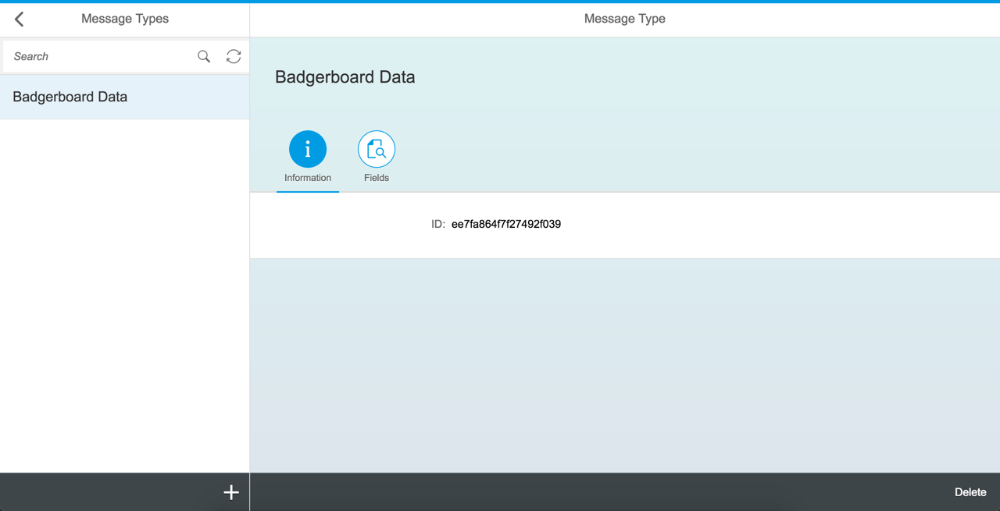 
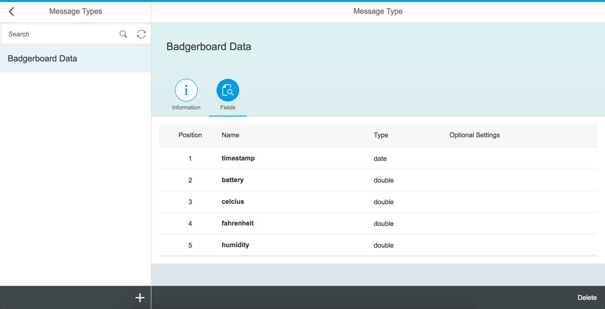 
2. Create a Device Type for your Badgerboard devices  
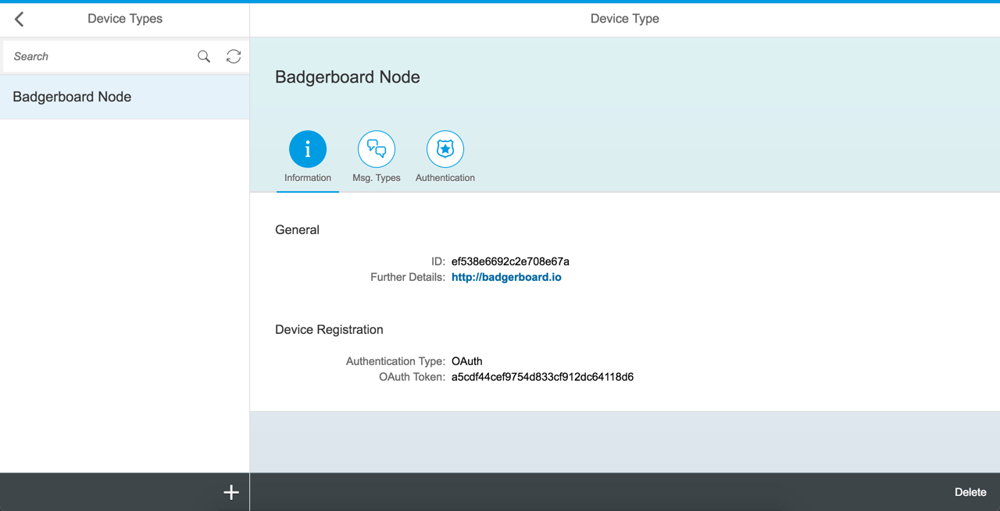 
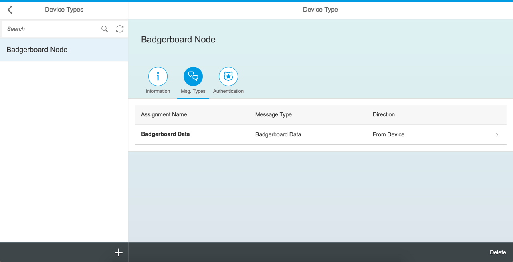 
3. Create a concrete Device 
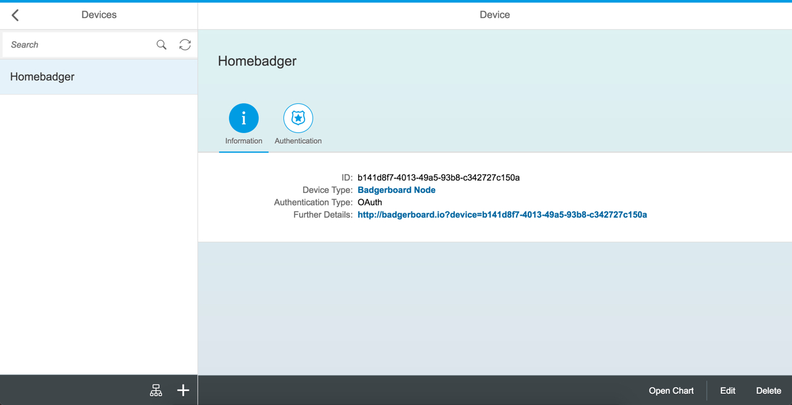 

##Output format
Based on the Prepartory work above, the MQTT Ingest application is supposed to publish messages for topic `iot/data/b141d8f7-4013-49a5-93b8-c342727c150a` with the following payload
```
{  
   "mode":"async",
   "messageType":"ee7fa864f7f27492f039",
   "messages":[  
      {  
         "battery":3.399,
         "celcius":33.09,
         "fahrenheit":91.56,
         "humidity":26.49,
         "timestamp":"2017-02-21T16:38:55.081110224Z"
      }
   ]
}
```

##MQTT Ingest Deployment
We already have our MQTT Ingest WAR archive. Simply, deploy it to SAP Cloud Platform from the Cockpit. 

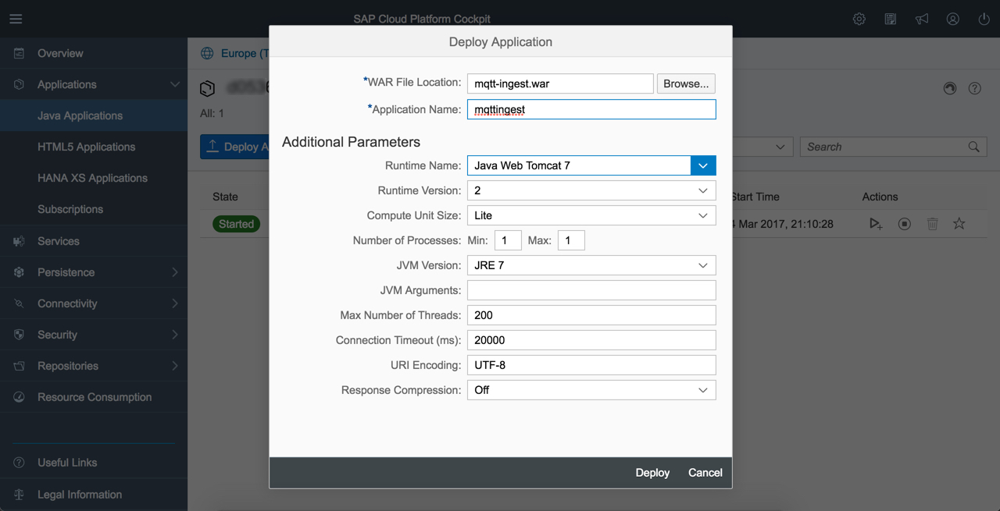 

>Deploy parameters do not really matter. Above ones were taken as an example. You may also deploy the WAR from command line interface.  

After deployment is done, the application has to be started. At the end, you will have 2 applications running in your account.  

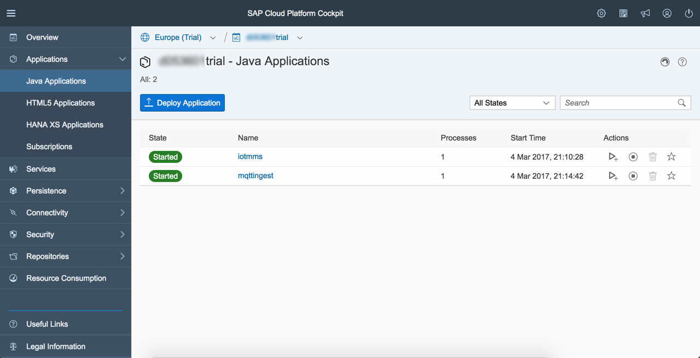 

MQTT Ingest application requires your user to be assigned to the predefined `MQTT-Ingest-User` role, so do not forget to make an assignment before you open application URL.

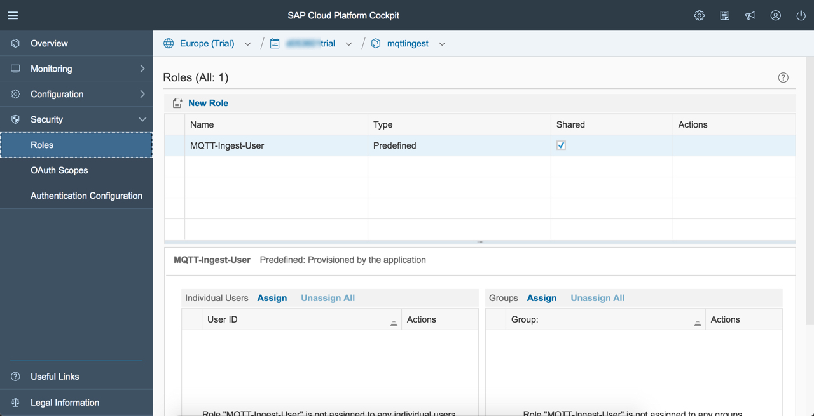 

##MQTT Ingest Configuration
Navigate to MQTT Ingest Overview and open application URL  

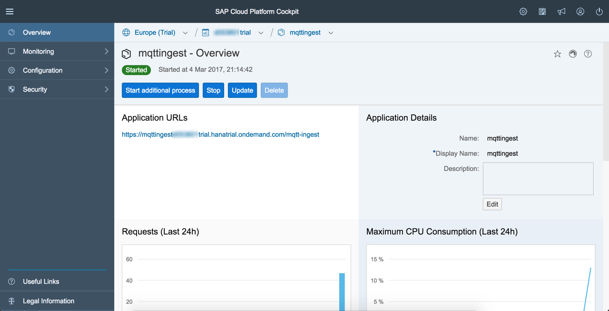 

Application provides a very simplistic UI. At the very first launch you will get a HTTP 404 error, which indicates that there is no configuration found by the MQTT Ingest, hence no MQTT subscriber and publisher are there to handle messages.

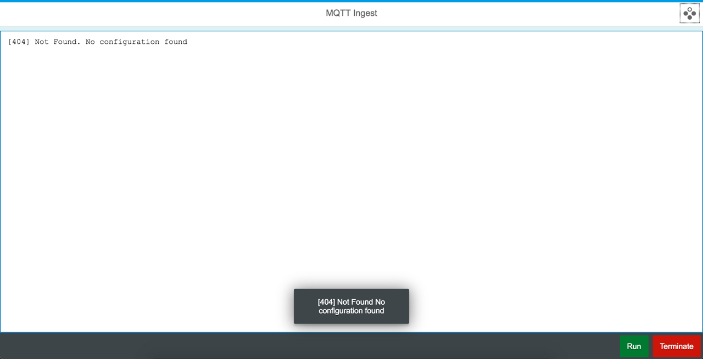 

Press on the button at top-right corner to show the configuration template

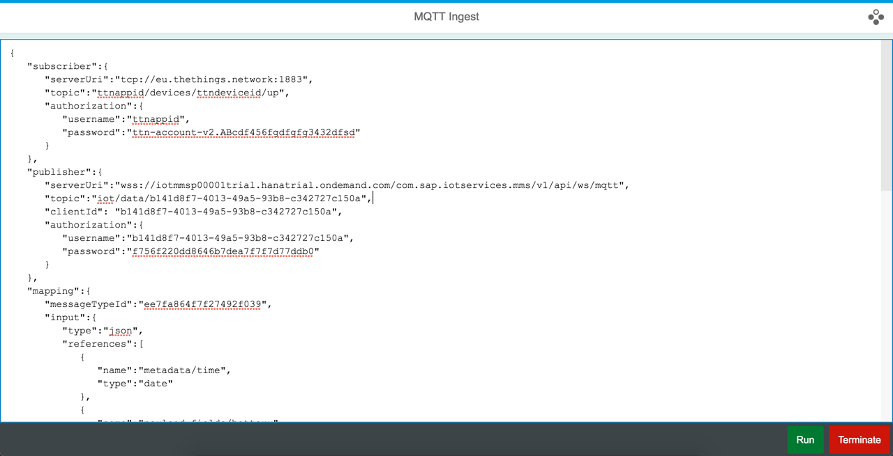 

Adapt necessary values and press Run button to save and activate your configuration. This will create two MQTT clients (namely subscriber and publisher) which will listen to / send messages, respectively. `mapping` section in the configuration is responsible to describe the mapping between two formats. In this particular case both input and output are JSON where hierarchical structure of the input is mapped to flat structure of the output.

>Pressing on Terminate button will disconnect existing MQTT clients and remove configuration. You may always reconfigure by providing the new configuration settings and hitting Run, this will disconnect current clients and connect new ones.

##Checking the result
After everything is configured and a device is publishing its sensor data, you will get it in MMS, visualized in the Cockpit, for example  

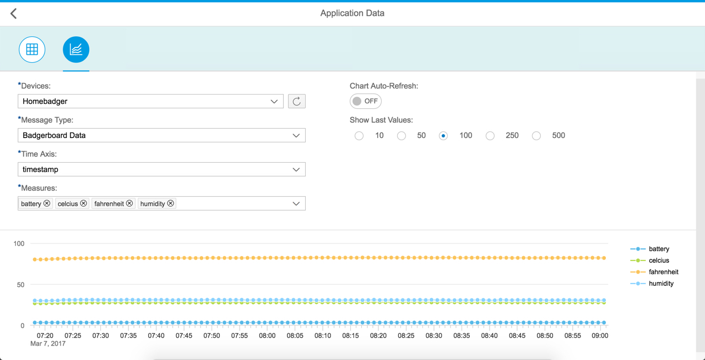 

#For your consideration:
>Such kind of configurations where user needs to specify endpoints, user credentials etc are supposed to be done using platform specific features like [Destinations](https://help.hana.ondemand.com/help/frameset.htm?e4f1d97cbb571014a247d10f9f9a685d.html). It is highly recommended to follow that approach for productive usage. This example application and its setup were simplified intentionally.

#TODOs:
- [ ] Optimize JSON serialization/deserialization (for configuration)
- [ ] Introduce JSON schema validation (for configuration)
- [ ] Improve error handling
- [ ] Support client certificate based authorization type
- [ ] Support sync/async mode option
- [ ] Provide more mapping examples in the README