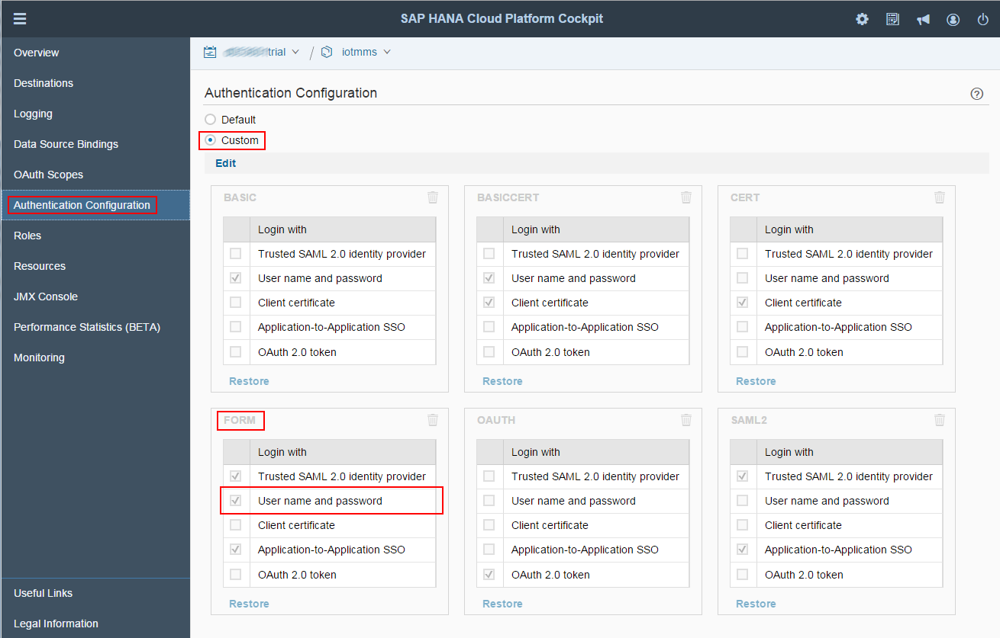

>Please, be advised that starting from MMS version 2.6.0 this configuration step is unnecessary.

# Getting started in the Cloud

## Authentication Configuration (MMS Push and OData API)

>Previous Step [Deploy the Message Management Service (MMS)](../mms)

The Push Service API is protected by means of Basic Authentication. 
The usage of this mechanism needs to be enabled explicitly in the SAP HANA Cloud Platform Cockpit (otherwise you will receive a Login Page instead of a success message as answer for a Push API request).

In order to enable Basic Authentication the following steps need to be executed:
* Go to the SAP HANA Cloud Platform Cockpit and select the ```iotmms``` application from the Java Application section.
* Go to the ```Authentication Configuration``` tab.
* Change type to ```Custom```.
* Add ```User name and password``` to the selection in the ```Form``` section.
* Restart the ```iotmms``` application.

