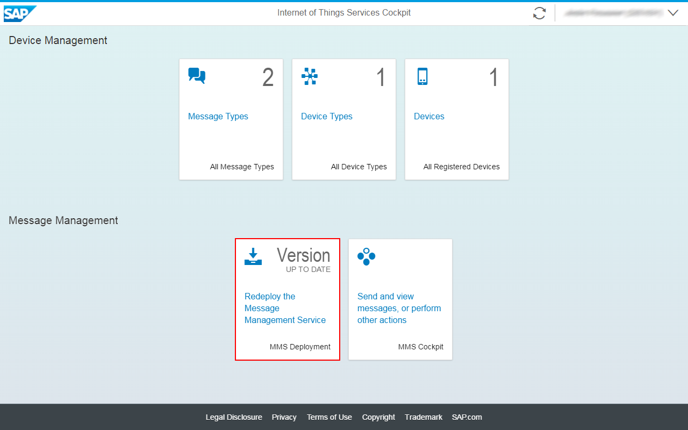

# Getting started in the Cloud

## Deploy the Message Management Service (MMS)

>Previous Step [Create Device Information in Internet of Things Services Cockpit](../cockpit)

The deployment of the Message Management Service (MMS) step needs to be done from the ```Deploy Message Management Service``` tile in the IoT Services Cockpit and deploys/starts the Message Management Service that takes care of receiving data from IoT Devices and sending to these. 



Then assign the Role IoT-MMS-User for the newly deployed ```iotmms``` Java Application (otherwise you will be denied access to the ```iotmms``` Application URL with an HTTP Status 403 Error). To do so: 
* Go to the Java Applications tab in your SAP HANA Cloud Platform cockpit of your account
* Choose the ```iotmms``` application
* Choose the Roles tab of the Application details
<br />
<br />


* Do the assignment of the role to your user.
<br />
<br />


The Push Service API is protected by means of Basic Authentication. 
The usage of this mechanism needs to be enabled explicitly in the SAP HANA Cloud Platform Cockpit (otherwise you will receive a Login Page instead of a success message as answer for a Push API request).

In order to enable Basic Authentication the following steps need to be executed:
* Go to the SAP HANA Cloud Platform Cockpit and select the ```iotmms``` application from the Java Application section.
* Go to the ```Authentication Configuration``` tab.
* Change type to ```Custom```.
* Add ```User name and password``` to the selection in the ```Form``` section.
* Restart the ```iotmms``` application.

Once MMS is deployed and you have correctly done role assignment as well as the
Authentication Configuration for the Push service you can click on the
```iotmms``` Java application URL in your HCP Cockpit and get to the MMS
Cockpit as shown below. It provides access to the MMS API as well as a "Display
stored messages" tile for the access to data received from IoT Devices.

