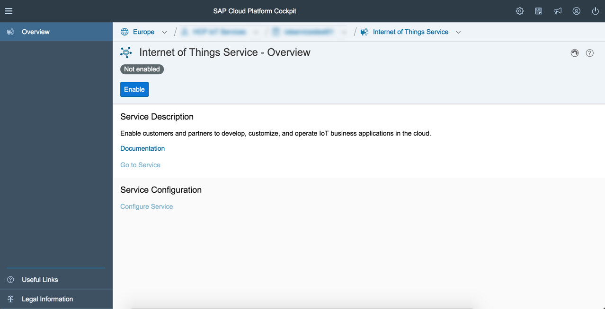

# Getting started in the Cloud

## Enable Internet of Things Services

>Previous Step [Get HANA Cloud Platform Developer Account](../account)

Before you can use the services you have to enable them in your HANA Cloud Platform Cockpit. Please execute the following steps in the documentation: 

For more details, please see the documentation: [Internet of Things Services](https://help.hana.ondemand.com/iot) > Getting Started > Enabling Internet of Things Services

You will need to do these steps to get access to the IoT Services Cockpit:
 
* In your HCP Cockpit navigate to "Services" section and click on "Internet of Things Services" tile.

* Press "Enable" button.

You are now ready for the next step and may already click on "Go to Service" link for that.

>Next Step [Create Device Information in Internet of Things Services Cockpit](../cockpit)